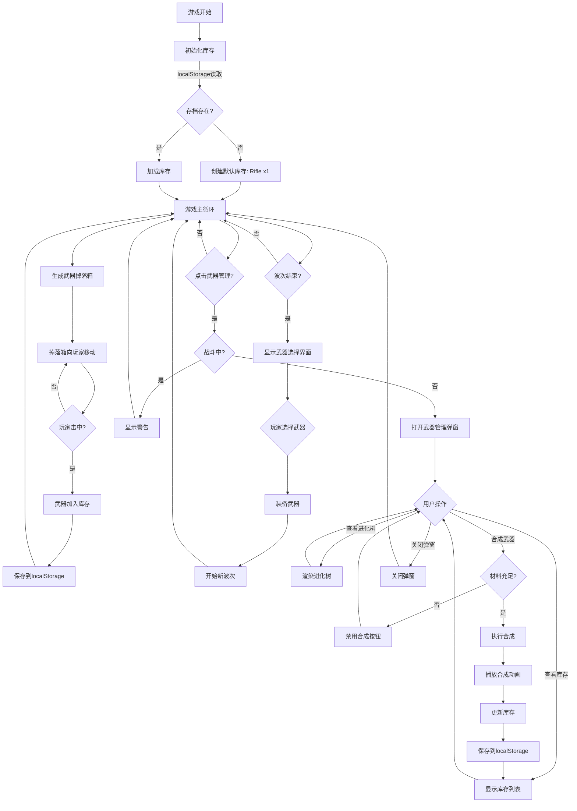

# 影响分析报告：武器进化系统

## 1. 上游依赖分析

### 1.1 依赖的现有模块

武器进化系统需要依赖以下现有模块：

| 上游模块 | 依赖内容 | 依赖类型 | 影响范围 |
|----------|----------|----------|----------|
| **CORE** | 游戏主循环、状态管理、Canvas上下文 | 强依赖 | 武器管理弹窗需暂停游戏循环；合成动画需要Canvas渲染 |
| **PLAYER** | `player` 对象、`player.weapon` 结构 | 强依赖 | 需要扩展 `player.weapon` 结构以支持等级信息；波次间武器选择影响玩家装备 |
| **COMBAT** | `Bullet` 类、子弹发射逻辑 | 中等依赖 | 终极武器穿透效果需修改 `Bullet.update()` 逻辑 |
| **DIFFICULTY** | `getPlayerPowerLevel()` 函数 | 中等依赖 | 武器等级需纳入火力等级计算公式 |
| **UI** | HUD渲染、事件监听、CSS样式 | 强依赖 | 新增武器管理弹窗、进化树可视化、库存UI组件 |

### 1.2 依赖的数据结构

#### 当前 `weaponTypes` 对象（game.js 第66-99行）
```javascript
const weaponTypes = {
    rifle: {
        name: '步枪',
        fireRate: 50,
        damage: 50,
        bulletCount: 1,
        color: '#ff7948',
        duration: 0 // 临时武器机制
    },
    // ...其他武器
}
```

**变更需求**：
- ✅ 保留：name, fireRate, damage, bulletCount, color
- ❌ 废除：duration（不再需要临时武器）
- ➕ 新增：tier（武器等级）、evolutionPath（进化路径）、nextTier（下一级武器）、id（武器唯一标识）

#### 当前 `player.weapon` 结构（game.js 第29-35行）
```javascript
weapon: {
    type: 'rifle',
    fireRate: 50,
    lastFire: 0,
    damage: 50,
    bulletCount: 1
}
```

**变更需求**：
- ✅ 保留所有现有字段
- ➕ 新增：tier（当前装备武器的等级）、id（武器唯一标识）

---

## 2. 下游影响分析

### 2.1 受影响的现有系统

| 下游系统 | 影响类型 | 影响内容 | 修改必要性 | 风险等级 |
|----------|----------|----------|------------|----------|
| **PLAYER** | 结构变更 | `player.weapon` 新增字段；波次间装备切换逻辑 | 必须修改 | ⚠️ 中 |
| **COMBAT** | 逻辑扩展 | 终极武器穿透效果（子弹可击中多个敌人） | 可选（首个MVP可不实现） | 🟢 低 |
| **DIFFICULTY** | 计算公式调整 | 武器等级影响火力倍率（`getPlayerPowerLevel()`） | 必须修改 | ⚠️ 中 |
| **UI** | 界面扩展 | 新增武器管理按钮、弹窗、进化树、库存界面 | 必须修改 | 🔴 高 |
| **WEAPON** | 重构核心逻辑 | WeaponDrop收集逻辑、武器切换逻辑、临时武器移除 | 必须修改 | 🔴 高 |

### 2.2 受影响的代码文件

#### game.js（核心逻辑）
**受影响行数**：约350行（共807行的43%）

| 受影响区域 | 行号范围 | 修改类型 | 详细说明 |
|------------|----------|----------|----------|
| 武器类型定义 | 66-99 | 结构扩展 | 移除 `duration`，新增 `tier`, `evolutionPath`, `nextTier`, `id` |
| WeaponDrop类 | 326-425 | 逻辑修改 | 收集武器后加入库存（不再直接装备）；移除临时武器计时器（404-417行） |
| 玩家对象 | 29-36 | 结构扩展 | `player.weapon` 新增 `tier`, `id` |
| 火力等级计算 | 622-634 | 公式调整 | 武器等级影响加成倍率 |
| 波次开始逻辑 | 596-600 | 逻辑插入 | 波次前显示武器选择界面 |
| 游戏主循环 | 714-804 | 状态检查 | 弹窗打开时暂停游戏（战斗外允许） |

#### index.html（界面结构）
**受影响行数**：约30行（新增）

| 新增区域 | 插入位置 | 内容 |
|----------|----------|------|
| 武器管理按钮 | header-right区域（第32行附近） | 添加"武器管理"按钮 |
| 武器管理弹窗 | `<main>` 标签内（第37行附近） | 模态弹窗容器（库存/进化树/合成三个标签页） |

#### style.css（样式扩展）
**受影响行数**：约150行（新增）

| 新增样式组 | 内容 |
|------------|------|
| 弹窗容器 | `.weapon-modal`, `.modal-overlay` |
| 标签页导航 | `.tab-nav`, `.tab-button`, `.tab-panel` |
| 库存网格 | `.inventory-grid`, `.weapon-card` |
| 进化树 | `.evolution-tree`, `.tree-node`, `.tree-connector` |
| 合成面板 | `.synthesis-panel`, `.synthesis-button` |

### 2.3 新增文件需求

| 新增文件 | 路径建议 | 功能 | 是否必需 |
|----------|----------|------|----------|
| weaponManager.js | /weaponManager.js | 武器库存管理、合成逻辑、进化树配置 | ✅ 强烈推荐（解耦） |
| weaponUI.js | /weaponUI.js | 武器管理弹窗、进化树渲染、库存界面 | ✅ 强烈推荐（解耦） |
| weaponConfig.json | /data/weaponConfig.json | 武器配置数据（进化树、属性） | ⚠️ 可选（可内联在JS中） |

---

## 3. 流程链分析

### 3.1 完整武器生命周期流程



### 3.2 关键流程节点说明

#### 节点1：武器掉落收集（修改现有逻辑）
**当前实现**（game.js 第392-417行）：
```javascript
// 击中掉落箱后直接切换武器
player.weapon.type = this.weaponType;
player.weapon.fireRate = weapon.fireRate;
player.weapon.damage = weapon.damage;
player.weapon.bulletCount = weapon.bulletCount;

// 设置临时武器过期时间
if (weapon.duration > 0) {
    setTimeout(() => { /* 恢复为步枪 */ }, weapon.duration);
}
```

**新实现**：
```javascript
// 击中掉落箱后加入库存（不直接装备）
weaponManager.addToInventory(this.weaponType);
weaponManager.saveInventory(); // 持久化
showNotification(`获得武器: ${weaponTypes[this.weaponType].name}`);
```

**影响范围**：
- ✅ 移除：临时武器计时器（404-417行）
- ➕ 新增：库存添加逻辑、通知提示

---

#### 节点2：波次间武器选择（新增流程）
**插入位置**：game.js 第596-600行（开始波次按钮点击事件）

**新逻辑**：
```javascript
document.getElementById('start-wave').addEventListener('click', () => {
    if (game.waveActive) return;

    // 新增：显示武器选择界面
    showWeaponSelectModal((selectedWeapon) => {
        if (selectedWeapon) {
            equipWeapon(selectedWeapon);
        }
        game.waveActive = true;
        spawnWave();
    });
});
```

**影响**：
- 波次开始流程增加1个交互步骤（玩家选择武器）
- 可跳过选择（保持当前装备）

---

#### 节点3：武器合成（全新流程）
**实现位置**：新增 weaponManager.js

**核心逻辑**：
```javascript
function synthesizeWeapon(weaponId) {
    const config = weaponConfig[weaponId];
    const inventory = getInventory();

    // 检查材料
    if (inventory[weaponId] < 3) {
        return { success: false, error: '材料不足' };
    }

    // 检查是否为最高级
    if (!config.nextTier) {
        return { success: false, error: '已是最高级武器' };
    }

    // 执行合成（原子操作）
    inventory[weaponId] -= 3;
    inventory[config.nextTier] = (inventory[config.nextTier] || 0) + 1;
    saveInventory(inventory);

    return { success: true, result: config.nextTier };
}
```

**影响**：
- 新增数据操作：localStorage读写
- 新增UI动画：合成特效
- 新增错误处理：材料不足、装备武器锁定

---

#### 节点4：终极武器融合（特殊合成）
**实现位置**：weaponManager.js

**触发条件**：
```javascript
// 检查是否同时拥有三个Super级武器
const hasSuperRifle = inventory['super_rifle'] >= 1;
const hasSuperMG = inventory['super_machinegun'] >= 1;
const hasSuperSG = inventory['super_shotgun'] >= 1;

if (hasSuperRifle && hasSuperMG && hasSuperSG) {
    // 允许融合为 ultimate_laser
    fusionButton.disabled = false;
}
```

**影响**：
- 需要特殊UI提示（进化树中高亮显示融合路径）
- 融合动画比普通合成更炫酷

---

## 4. 变更范围界定

### 4.1 代码修改清单

#### 必须修改的代码（P0 - 核心功能）

| 文件 | 修改区域 | 修改类型 | 工作量估算 |
|------|----------|----------|------------|
| game.js | 第66-99行（weaponTypes） | 结构扩展 | 2小时 |
| game.js | 第326-425行（WeaponDrop） | 逻辑重构 | 3小时 |
| game.js | 第596-600行（波次开始） | 逻辑插入 | 2小时 |
| game.js | 第622-634行（火力计算） | 公式调整 | 1小时 |
| index.html | 新增弹窗结构 | 新增HTML | 3小时 |
| style.css | 新增弹窗样式 | 新增CSS | 4小时 |
| weaponManager.js | 全新文件 | 新增模块 | 8小时 |
| weaponUI.js | 全新文件 | 新增模块 | 10小时 |

**总计**：约33小时（4-5个工作日）

#### 可选修改的代码（P1 - 增强功能）

| 文件 | 修改区域 | 功能 | 工作量估算 |
|------|----------|------|------------|
| game.js | Bullet类（504-568行） | 终极武器穿透效果 | 3小时 |
| weaponUI.js | 合成动画 | 粒子特效动画 | 4小时 |
| weaponUI.js | 进化树Canvas渲染 | 树状图自动布局 | 6小时 |

**总计**：约13小时（1.5个工作日）

### 4.2 数据结构新增

#### localStorage 新增键

| 键名 | 数据类型 | 示例值 | 用途 |
|------|----------|--------|------|
| `monsterTide_weaponInventory` | Object | `{rifle: 5, "rifle+": 1, ...}` | 武器库存 |
| `monsterTide_equippedWeapon` | String | `"rifle+"` | 当前装备武器ID |
| `monsterTide_version` | String | `"2.0.0"` | 存档版本（用于迁移） |

#### 新增配置对象

```javascript
// weaponConfig.js 或内联在 weaponManager.js
const weaponEvolutionConfig = {
    rifle: {
        id: 'rifle',
        name: '步枪',
        tier: 1,
        damage: 50,
        fireRate: 50,
        bulletCount: 1,
        color: '#ff7948',
        evolutionPath: 'rifle',
        nextTier: 'rifle+'
    },
    'rifle+': {
        id: 'rifle+',
        name: '步枪+',
        tier: 2,
        damage: 65,
        fireRate: 45,
        bulletCount: 1,
        color: '#ff8958',
        evolutionPath: 'rifle',
        nextTier: 'rifle++'
    },
    // ... 其他武器（共13个武器配置）
    ultimate_laser: {
        id: 'ultimate_laser',
        name: '终极激光炮',
        tier: 5,
        damage: 150,
        fireRate: 10,
        bulletCount: 1,
        color: '#00ffff',
        specialEffect: 'penetration',
        evolutionPath: 'ultimate',
        nextTier: null // 最高级
    }
};
```

---

## 5. 风险评估

### 5.1 技术风险

| 风险项 | 风险等级 | 概率 | 影响 | 缓解措施 |
|--------|----------|------|------|----------|
| **localStorage容量不足** | 🔴 高 | 低 | 高 | 1. 限制库存最大容量（每种武器999个）<br>2. 定期清理无效数据<br>3. 降级到内存存储 |
| **老存档兼容性问题** | ⚠️ 中 | 高 | 中 | 1. 检测存档版本号<br>2. 自动迁移逻辑（无库存→初始化Rifle x1）<br>3. 迁移失败显示错误提示 |
| **合成逻辑并发问题** | ⚠️ 中 | 中 | 中 | 1. 合成时禁用按钮<br>2. 使用锁机制防止重复提交<br>3. 原子化操作（全部成功或全部失败） |
| **UI渲染性能问题** | 🟢 低 | 低 | 低 | 1. 进化树节点<50个（当前仅13个）<br>2. 使用requestAnimationFrame优化动画<br>3. 虚拟滚动优化库存列表 |
| **武器切换打断战斗** | 🔴 高 | 高 | 高 | 1. 战斗中禁止打开武器管理<br>2. 波次间显示明确提示<br>3. 误操作时显示警告 |

### 5.2 业务风险

| 风险项 | 风险等级 | 影响 | 缓解措施 |
|--------|----------|------|----------|
| **游戏平衡性破坏** | ⚠️ 中 | 玩家获得终极武器后游戏失去挑战性 | 1. 难度系统同步调整（终极武器火力倍率×5）<br>2. 限制终极武器获取难度（需要大量时间收集）<br>3. 后续波次怪物血量×10 |
| **学习曲线陡峭** | ⚠️ 中 | 新玩家不理解合成规则 | 1. 首次进入显示教程弹窗<br>2. 进化树中显示合成提示<br>3. 材料不足时显示明确说明 |
| **武器掉落频率失衡** | 🟢 低 | 永久化后掉落过快导致收集太容易 | 1. 测试调整掉落概率（当前8%）<br>2. 监控玩家平均获得终极武器时间<br>3. 可能降低至5% |

### 5.3 用户体验风险

| 风险项 | 风险等级 | 影响 | 缓解措施 |
|--------|----------|------|----------|
| **弹窗打断流畅性** | ⚠️ 中 | 频繁打开弹窗影响战斗节奏 | 1. 仅波次间自动显示武器选择<br>2. 战斗中完全禁止弹窗<br>3. ESC键快速关闭 |
| **合成操作不可逆** | ⚠️ 中 | 玩家误操作后无法撤销 | 1. 合成前显示二次确认弹窗<br>2. 高亮显示消耗材料数量<br>3. 禁止合成当前装备武器 |
| **进化树复杂度** | 🟢 低 | 玩家难以理解进化路径 | 1. 使用颜色区分三条路径<br>2. 已拥有武器高亮显示<br>3. 显示合成箭头和所需材料 |

---

## 6. 建议的实施顺序

### 阶段1：基础设施搭建（1-2天）

**目标**：建立武器管理核心架构，不破坏现有功能

#### 任务清单
1. ✅ **创建 weaponManager.js**
   - 实现 `getInventory()`, `saveInventory()`, `addToInventory()`
   - 实现 localStorage 读写逻辑
   - 实现版本检测和自动迁移

2. ✅ **扩展 weaponTypes 配置**
   - 新增 `tier`, `evolutionPath`, `nextTier`, `id` 字段
   - 定义完整的13个武器配置（3条路径×4级 + 1个终极）

3. ✅ **修改 WeaponDrop.update()**
   - 移除临时武器计时器逻辑（404-417行）
   - 改为调用 `weaponManager.addToInventory()`

**验收标准**：
- 击中掉落箱后武器加入库存（可打开控制台查看localStorage）
- 老存档自动迁移（无库存→Rifle x1）
- 不影响现有游戏流程

---

### 阶段2：武器合成系统（2-3天）

**目标**：实现3合1线性合成和终极融合

#### 任务清单
1. ✅ **实现合成逻辑**
   - `synthesizeWeapon(weaponId)` 函数（3:1合成）
   - `fuseUltimateWeapon()` 函数（三Super融合）
   - 材料检查、装备锁定、原子操作

2. ✅ **创建武器管理弹窗UI**
   - 添加"武器管理"按钮到 index.html
   - 实现模态弹窗容器（.weapon-modal）
   - 实现标签页导航（库存/进化树/合成）

3. ✅ **实现合成界面**
   - 武器选择下拉框
   - 材料数量显示
   - 合成按钮（材料不足时禁用）
   - 合成成功动画

**验收标准**：
- 拥有3个Rifle时可合成为Rifle+
- 材料不足时按钮禁用且显示提示
- 合成成功后库存正确更新

---

### 阶段3：库存与进化树界面（2-3天）

**目标**：实现库存可视化和进化树展示

#### 任务清单
1. ✅ **实现库存界面**
   - 网格布局显示所有武器
   - 显示武器图标（简化的Canvas绘制或CSS图形）
   - 显示武器名称和数量
   - 点击武器显示详细属性

2. ✅ **实现进化树界面**
   - 树状布局（3条垂直路径）
   - 节点表示武器（已拥有/可合成/锁定状态）
   - 连接线表示进化关系
   - 节点悬停显示属性和合成要求

3. ✅ **CSS样式实现**
   - 赛博朋克风格一致性
   - 霓虹特效（hover、glow）
   - 响应式布局（适配900×700画布）

**验收标准**：
- 库存界面正确显示所有拥有的武器和数量
- 进化树清晰展示三条路径和融合路径
- 已拥有武器高亮，可合成武器突出显示

---

### 阶段4：武器切换系统（1-2天）

**目标**：实现波次间武器选择和装备切换

#### 任务清单
1. ✅ **实现武器选择界面**
   - 波次开始前显示武器选择弹窗
   - 列出库存中数量>0的武器
   - 可预览武器属性
   - 确认后装备武器

2. ✅ **修改波次开始逻辑**
   - 在 `start-wave` 点击事件中插入选择流程
   - 战斗中禁止切换武器
   - 未选择时保持当前装备

3. ✅ **更新装备状态显示**
   - 游戏内显示当前武器等级（Rifle+）
   - 更新伤害显示（包含等级加成）

**验收标准**：
- 波次开始前弹出武器选择界面
- 选择武器后正确装备
- 战斗中无法打开武器管理

---

### 阶段5：难度平衡与优化（1-2天）

**目标**：调整游戏平衡性，确保高级武器不破坏难度

#### 任务清单
1. ✅ **调整火力等级计算**
   - 修改 `getPlayerPowerLevel()` 函数
   - 武器等级影响加成倍率
   - 终极武器额外加成

2. ✅ **测试与调优**
   - 测试各等级武器的平衡性
   - 调整怪物生成速率
   - 调整掉落概率
   - 调整武器属性数值

3. ✅ **错误处理与边界情况**
   - localStorage满时降级处理
   - 并发合成防护
   - 误操作二次确认

**验收标准**：
- 终极武器下怪物生成速度显著加快
- 游戏保持挑战性（不会一击秒杀所有怪物）
- 无明显bug或崩溃

---

### 阶段6：打磨与发布（1天）

**目标**：优化体验，准备发布

#### 任务清单
1. ✅ **动画与音效**
   - 合成成功动画（粒子特效）
   - 武器切换过渡动画
   - 获得武器通知提示

2. ✅ **性能优化**
   - 减少不必要的重绘
   - 优化进化树渲染
   - 优化localStorage读写频率

3. ✅ **文档与测试**
   - 编写用户指南（游戏内教程）
   - 全流程测试
   - 跨浏览器兼容性测试

**验收标准**：
- 所有动画流畅（>=60fps）
- 无控制台错误
- Chrome/Firefox/Safari正常运行

---

## 7. 总结与建议

### 7.1 关键发现

1. **模块耦合度高**：当前game.js单文件807行，武器系统与玩家、战斗、难度强耦合
2. **数据结构扩展性好**：`weaponTypes`对象易于扩展，只需新增字段
3. **UI扩展空间充足**：现有界面布局为右侧面板预留了空间
4. **性能瓶颈较小**：武器系统不涉及高频计算，localStorage读写可控

### 7.2 架构建议

#### 建议1：解耦武器管理
**理由**：武器进化系统逻辑复杂（库存、合成、进化树），放在game.js会导致文件过大。

**方案**：
```
/game.js         (核心游戏循环、Canvas渲染)
/weaponManager.js (武器库存、合成逻辑、数据持久化)
/weaponUI.js      (武器管理弹窗、进化树、库存界面)
```

**收益**：
- 代码可读性提升
- 便于单元测试
- 便于后续扩展（武器皮肤、成就系统）

---

#### 建议2：使用配置驱动
**理由**：13个武器配置硬编码在代码中难以维护。

**方案**：
```javascript
// weaponEvolutionConfig.js
export const WEAPON_EVOLUTION_TREE = {
    rifle: { /* ... */ },
    'rifle+': { /* ... */ },
    // ...
};

export const EVOLUTION_PATHS = {
    rifle: ['rifle', 'rifle+', 'rifle++', 'super_rifle'],
    machinegun: ['machinegun', 'machinegun+', 'machinegun++', 'super_machinegun'],
    shotgun: ['shotgun', 'shotgun+', 'shotgun++', 'super_shotgun']
};
```

**收益**：
- 配置与代码分离
- 便于数值策划调整
- 便于自动化测试（遍历配置生成测试用例）

---

#### 建议3：渐进式交付
**理由**：一次性实现所有功能风险高，建议分阶段发布。

**MVP版本**（第1-4阶段）：
- ✅ 武器库存与持久化
- ✅ 3合1线性合成
- ✅ 波次间武器选择
- ❌ 终极武器融合（延后）
- ❌ 穿透效果（延后）
- ❌ 合成动画（简化版）

**完整版本**（第5-6阶段）：
- ✅ 终极武器融合
- ✅ 穿透效果
- ✅ 合成动画特效
- ✅ 难度平衡调优

**收益**：
- 降低风险（MVP可独立运行）
- 快速验证核心玩法
- 用户反馈指导后续开发

---

### 7.3 优先级建议

#### 必须实现（P0）
- 武器库存持久化（localStorage）
- 3合1线性合成
- 库存界面
- 波次间武器切换
- 老存档迁移

#### 强烈推荐（P1）
- 进化树可视化
- 终极武器融合
- 合成动画
- 难度平衡调整

#### 可选实现（P2）
- 终极武器穿透效果
- 合成粒子特效
- 武器图鉴系统
- 成就系统

---

### 7.4 风险缓解总结

| 风险 | 缓解措施 |
|------|----------|
| localStorage容量不足 | 限制库存999、降级到内存存储 |
| 老存档兼容性 | 版本检测、自动迁移、错误提示 |
| 合成并发冲突 | 禁用按钮、锁机制、原子操作 |
| 游戏平衡破坏 | 难度系统同步调整、终极武器火力×5 |
| 用户误操作 | 二次确认、禁止合成装备武器 |
| UI性能问题 | 节点<50个、虚拟滚动、requestAnimationFrame |

---

## 8. 附录：数据流图

### 8.1 武器收集与存储流程

```
[击中WeaponDrop]
    ↓
[WeaponDrop.update()]
    ↓
[weaponManager.addToInventory(weaponType)]
    ↓
[inventory[weaponType]++]
    ↓
[weaponManager.saveInventory()]
    ↓
[localStorage.setItem('monsterTide_weaponInventory', JSON.stringify(inventory))]
    ↓
[显示通知："获得武器: 机枪"]
```

### 8.2 武器合成流程

```
[用户点击合成按钮]
    ↓
[weaponManager.synthesizeWeapon(weaponId)]
    ↓
[检查材料数量 >= 3]
    ↓           ↓
  [不足]      [充足]
    ↓           ↓
[返回错误]   [消耗3个原武器]
             ↓
         [增加1个新武器]
             ↓
         [saveInventory()]
             ↓
         [播放合成动画]
             ↓
         [更新UI显示]
```

### 8.3 火力等级计算流程

```
[getPlayerPowerLevel()]
    ↓
[获取当前武器等级 player.weapon.tier]
    ↓
[计算武器加成：weaponMultiplier = tier * 0.5]
    ↓
[计算玩家数量加成：countMultiplier = min(player.count / 5, 3)]
    ↓
[powerLevel = 1 + weaponMultiplier + countMultiplier]
    ↓
[影响怪物生成速率：spawnRate = baseSpawnRate / powerLevel]
```

---

## 9. Breaking Change 评估 (ISS-L1C-011)

### 9.1 Breaking Change 清单

| 变更 | Breaking? | 影响范围 | 风险等级 | 迁移方案 |
|------|----------|---------|---------|---------|
| **移除 weaponTypes.duration 字段** | ✅ Breaking | 临时武器机制废除，老玩家装备激光炮时会丢失 | 🔴 高 | 迁移时自动转换为 Super Rifle (等价武器) |
| **新增 weaponTypes.tier 字段** | ❌ Compatible | 新增字段，向后兼容 | 🟢 低 | 老版本 weapon 对象默认 tier=1 |
| **新增 weaponTypes.evolutionPath 字段** | ❌ Compatible | 新增字段，向后兼容 | 🟢 低 | 老版本默认 evolutionPath='rifle' |
| **新增 weaponTypes.nextTier 字段** | ❌ Compatible | 新增字段，向后兼容 | 🟢 低 | 老版本默认 nextTier=null |
| **WeaponDrop 不再直接装备武器** | ✅ Breaking | 战斗中拾取武器流程变更 | ⚠️ 中 | 显示通知: "武器已加入库存"，波次间切换 |
| **移除激光炮 (laser) 武器类型** | ✅ Breaking | 老玩家可能拥有激光炮 | ⚠️ 中 | 迁移时转换为 ultimate_laser |
| **localStorage 数据结构变更** | ✅ Breaking | 存档格式从字符串变为对象 | 🔴 高 | 自动检测旧格式并转换 (MIG-001) |
| **player.weapon 新增 tier 和 id 字段** | ❌ Compatible | 扩展玩家对象结构 | 🟢 低 | 老代码忽略新字段 |
| **波次开始前强制武器选择** | ✅ Breaking | 游戏流程增加交互步骤 | ⚠️ 中 | 可跳过选择（保持当前装备） |
| **火力等级计算公式变更** | ✅ Breaking | 难度调整逻辑改变 | ⚠️ 中 | 老存档玩家难度重新校准 |

### 9.2 Breaking Change 迁移策略

#### 迁移 1: 移除 duration 字段
**问题**: 老代码可能依赖 `weapon.duration` 判断临时武器
**解决方案**:
```javascript
// 迁移脚本
const oldWeaponTypes = {
  machinegun: { duration: 10000, ... },
  shotgun: { duration: 8000, ... },
  laser: { duration: 12000, ... }
};

// 转换逻辑
for (const weaponId in oldWeaponTypes) {
  const oldConfig = oldWeaponTypes[weaponId];
  if (oldConfig.duration > 0) {
    // 临时武器转换为对应的高级武器
    const mappingMap = {
      machinegun: 'machinegun+',
      shotgun: 'shotgun+',
      laser: 'ultimate_laser'
    };
    inventory[mappingMap[weaponId]] = inventory[weaponId] || 0;
    delete inventory[weaponId]; // 清理老武器
  }
}
```

#### 迁移 2: localStorage 数据格式升级
**问题**: 老版本存档为简单字符串 `"rifle"` 或无存档
**解决方案**: 自动检测并转换（见 data-flow.md 3.3 节）
```javascript
// 迁移检测
const oldData = localStorage.getItem('monsterTide_weaponInventory');
if (oldData && typeof JSON.parse(oldData) === 'string') {
  // 老格式: "rifle" 或 "machinegun"
  const weaponId = JSON.parse(oldData);
  const newInventory = { [weaponId]: 1 };
  localStorage.setItem('monsterTide_weaponInventory', JSON.stringify(newInventory));
}
```

#### 迁移 3: 移除激光炮 (laser)
**问题**: 老玩家可能装备激光炮，新版本无此武器
**解决方案**: 自动转换为终极激光炮（升级奖励）
```javascript
if (player.weapon.type === 'laser') {
  player.weapon.type = 'ultimate_laser';
  player.weapon.id = 'ultimate_laser';
  player.weapon.tier = 5;
  showNotification('激光炮已升级为终极激光炮！');
}
```

### 9.3 影响用户群体

| 用户类型 | 影响 | 应对策略 |
|---------|------|---------|
| **新玩家** | 无影响 | 直接使用新系统 |
| **轻度玩家（<5波）** | 仅丢失临时武器 | 显示通知："武器系统已升级，初始库存已设置" |
| **中度玩家（5-10波）** | 可能丢失激光炮 | 自动转换为 ultimate_laser（升级奖励） |
| **重度玩家（>10波）** | 难度重新校准 | 根据成就奖励额外武器（如 machinegun x1） |

---

## 10. 向后兼容性保证 (ISS-L1C-012)

### 10.1 兼容性承诺

**兼容性级别**: 数据迁移 + 功能演进

| 兼容性项 | 保证内容 | 有效期 |
|---------|---------|--------|
| **存档数据格式** | 自动迁移 v1.x → v2.0 | 永久（迁移脚本保留） |
| **临时武器转换** | 老临时武器自动转换为对应永久武器 | v2.0.0 发布后 6 个月 |
| **激光炮升级** | laser → ultimate_laser（升级奖励） | 永久 |
| **游戏流程** | 新增武器选择步骤，可跳过（默认保持当前装备） | 永久 |
| **UI 交互** | 战斗中无法打开武器管理（警告提示） | 永久（游戏规则） |

### 10.2 保留的旧功能

| 旧功能 | 新版本状态 | 说明 |
|-------|----------|------|
| 武器掉落箱 | ✅ 保留 | 机制不变，仅改为加入库存而非直接装备 |
| 基础武器类型 (rifle/machinegun/shotgun) | ✅ 保留 | 作为 Lv1 武器保留，属性不变 |
| 波次间切换武器 | ✅ 保留 | 原有逻辑，新增可视化选择界面 |
| 默认武器 (rifle) | ✅ 保留 | 所有玩家初始拥有 1 个 Rifle |

### 10.3 废弃功能

| 废弃功能 | 废弃时间 | 替代方案 |
|---------|---------|---------|
| 临时武器机制 (duration) | v2.0.0 立即废弃 | 永久库存系统 |
| 激光炮 (laser) 独立武器 | v2.0.0 立即废弃 | 终极激光炮 (ultimate_laser) Lv5 武器 |
| 自动过期武器 | v2.0.0 立即废弃 | 波次间手动切换 |

### 10.4 迁移支持时间表

| 时间 | 支持内容 |
|------|---------|
| **v2.0.0 发布日** | 自动检测老存档并迁移 |
| **v2.0.0 + 1 个月** | 监控迁移失败率，收集用户反馈 |
| **v2.0.0 + 3 个月** | 优化迁移逻辑（如发现问题） |
| **v2.0.0 + 6 个月** | 迁移脚本进入维护模式 |
| **v2.0.0 + 12 个月** | 仅保留 v2.x 存档支持，v1.x 警告提示 |

### 10.5 降级策略

**问题**: 玩家如果希望回退到旧版本怎么办？

**解决方案**:
1. **数据备份**: 迁移前自动备份到 `monsterTide_weaponInventory_backup` (保留 30 天)
2. **回退限制**: 回退到 v1.x 后，新版本数据无法恢复（显示警告）
3. **版本标记**: localStorage 存储 `monsterTide_version = "2.0.0"`，v1.x 检测到后显示不兼容提示

---

**报告状态**：草案（Draft）
**下一步**：
1. 技术团队评审（评估工作量和可行性）
2. 产品团队确认（确认优先级和MVP范围）
3. 更新为 approved 状态后进入开发阶段

**相关文档**：
- 需求文档：`hhspec/changes/weapon-evolution-system/specs/requirements/WEAPON/weapon-evolution-requirements.md`
- 架构文档：`hhspec/specs/architecture/domain-model.md`
- 领域定义：`hhspec/domains.yml`
