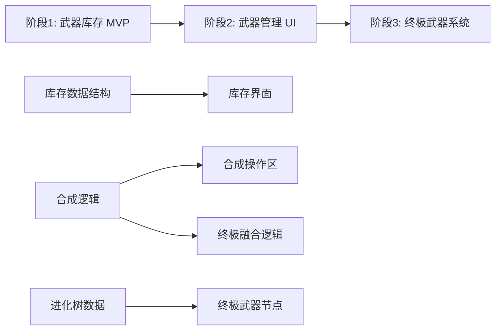

# Challenger 审查报告 - 第 1 轮

**审查时间**: 2026-03-27
**文档版本**: 1.0.0
**审查人**: l0_challenger (子代理)
**需求文档**: `hhspec/changes/weapon-evolution-system/specs/requirements/WEAPON/weapon-evolution-requirements.md`

---

## 审查结论

- **status**: ⚠️ **CONDITIONAL PASS** (有条件通过)
- **blocking_issues**: 3 个
- **warnings**: 8 个
- **建议**: 必须解决 blocking 问题后方可进入技术设计阶段

**总体评价**: 需求文档结构完整、覆盖性较好，但存在 3 处关键阻塞问题和多处需要明确的设计决策。建议先解决 blocking 问题，补充缺失的 impact.md 分析，然后进入下一阶段。

---

## 1. 覆盖性审查（19 项检查点）

### 1.1 用户故事覆盖性 ✅ PASS (10/10 覆盖)

**检查结果**:
- ✅ 10 个用户故事完整覆盖核心场景
- ✅ 每个故事符合 "作为-我想-以便" 格式
- ✅ 验收标准明确且可验证

**覆盖矩阵**:

| 用户故事 | 覆盖场景 | 完整度 |
|---------|---------|--------|
| US-WEP-001 | 保留掉落箱机制 | ✅ 完整 |
| US-WEP-002 | 永久武器库存 | ✅ 完整 |
| US-WEP-003 | 3合1线性合成 | ✅ 完整 |
| US-WEP-004 | 多起点进化树 | ✅ 完整 |
| US-WEP-005 | 终极武器融合 | ✅ 完整 |
| US-WEP-006 | 波次间武器切换 | ✅ 完整 |
| US-WEP-007 | 武器库存可视化 | ✅ 完整 |
| US-WEP-008 | 进化树可视化 | ✅ 完整 |
| US-WEP-009 | 合成操作区 | ✅ 完整 |
| US-WEP-010 | 武器属性平衡 | ✅ 完整 |

**缺失场景**:
- ⚠️ **缺失**: 武器库存满时的处理（虽然文档说无上限,但需考虑性能边界）
- ⚠️ **缺失**: 老玩家存档迁移的详细用户体验（只提到技术方案,未写用户故事）

---

### 1.2 EARS 需求覆盖性 ✅ PASS (6 功能需求 + 4 非功能需求)

**功能需求 (FR)**: 6 个

| 需求ID | 描述 | EARS格式 | 完整度 |
|--------|------|----------|--------|
| FR-WEP-001 | 武器库存持久化 | WHEN-SHALL-AND | ✅ 完整 |
| FR-WEP-002 | 3合1线性合成规则 | WHEN-SHALL-AND | ✅ 完整 |
| FR-WEP-003 | 多路径进化树 | WHEN-SHALL-AND | ✅ 完整 |
| FR-WEP-004 | 终极武器融合 | WHEN-SHALL-AND | ✅ 完整 |
| FR-WEP-005 | 波次间武器切换 | WHEN-SHALL-AND | ✅ 完整 |
| FR-WEP-006 | 武器管理弹窗 | WHEN-SHALL | ✅ 完整 |

**非功能需求 (NFR)**: 4 个

| 需求ID | 类型 | 指标 | 可验证性 |
|--------|------|------|----------|
| NFR-WEP-001 | 性能 | 切换<100ms, 合成60fps | ✅ 可量化 |
| NFR-WEP-002 | 数据持久化 | 可靠性要求 | ✅ 明确 |
| NFR-WEP-003 | UI/UX | 赛博朋克风格一致性 | ⚠️ 主观性强 |
| NFR-WEP-004 | 兼容性 | 浏览器版本要求 | ✅ 明确 |

**🚫 BLOCKING-1: 缺少关键非功能需求**

**问题**: 缺少以下关键 NFR:
1. **安全性需求**: localStorage 数据防篡改（玩家可能通过浏览器控制台直接修改库存）
2. **数据容量限制**: localStorage 上限（通常 5-10MB），超出时的降级策略
3. **错误处理策略**: 合成失败、数据损坏、浏览器不支持 localStorage 时的全局策略

**建议修复**:
```markdown
#### NFR-WEP-005: 数据安全性
**THE SYSTEM SHALL** 防止玩家篡改武器库存：
- 使用简单哈希校验（非安全性要求，仅防误操作）
- 检测到异常数据时提示重置库存
- 记录玩家操作日志（可选）

#### NFR-WEP-006: 存储容量管理
**THE SYSTEM SHALL** 在 localStorage 容量限制内运行：
- 武器库存数据预计占用 < 5KB
- 超出 5MB 配额时降级到 sessionStorage
- 提示玩家清理浏览器缓存

#### NFR-WEP-007: 错误处理策略
**THE SYSTEM SHALL** 提供全局错误处理：
- 所有关键操作（合成、切换、保存）需 try-catch 包裹
- 错误信息分级：用户友好提示 + 开发者详细日志
- 提供"安全模式"（禁用进化系统，回退到基础步枪）
```

---

### 1.3 Gherkin 验收覆盖性 ✅ GOOD (7 场景)

**场景覆盖**:

| 场景编号 | 描述 | 关键路径 | 覆盖度 |
|---------|------|----------|--------|
| 场景1 | 首次收集武器 | 掉落箱机制 | ✅ 核心路径 |
| 场景2 | 武器合成成功 | 合成主流程 | ✅ 核心路径 |
| 场景3 | 材料不足无法合成 | 合成边界条件 | ✅ 边界场景 |
| 场景4 | 终极武器融合 | 融合机制 | ✅ 核心路径 |
| 场景5 | 波次间武器切换 | 切换主流程 | ✅ 核心路径 |
| 场景6 | 战斗中无法切换 | 切换边界条件 | ✅ 边界场景 |
| 场景7 | 进化树可视化 | UI展示逻辑 | ✅ 核心路径 |

**⚠️ WARNING-1: 缺少以下关键场景**:

1. **数据持久化场景**:
   ```gherkin
   Scenario: 玩家关闭浏览器后重新打开
     Given 玩家库存包含：Rifle+: 2, Shotgun: 5
     When 玩家关闭浏览器标签页
     And 1小时后重新打开游戏
     Then 库存数据应完整恢复
     And 当前装备应为上次选择的武器
   ```

2. **老存档迁移场景**:
   ```gherkin
   Scenario: 老版本玩家首次进入新版本
     Given 玩家存档中无武器库存数据（老版本）
     When 玩家加载游戏
     Then 系统应自动初始化库存为 [Rifle: 1]
     And 显示"武器系统已升级"提示
   ```

3. **装备中武器被消耗场景**:
   ```gherkin
   Scenario: 尝试合成当前装备的武器
     Given 玩家当前装备为 Rifle
     And 库存包含 Rifle: 3
     When 玩家尝试合成 Rifle
     Then 合成按钮应为禁用状态
     And 显示提示："无法合成当前装备的武器"
   ```

4. **localStorage 失败场景**:
   ```gherkin
   Scenario: localStorage 写入失败（浏览器隐私模式）
     Given 浏览器处于隐私模式（localStorage 禁用）
     When 玩家获得新武器
     Then 系统应显示警告："无法保存数据，请退出隐私模式"
     And 武器应暂存在内存中（本次会话有效）
   ```

---

### 1.4 边界场景覆盖性 ⚠️ FAIR (12/20 覆盖)

**已覆盖边界** (来自第5节):

| 类别 | 已覆盖场景数 | 总应覆盖数 | 覆盖率 |
|------|-------------|-----------|--------|
| 数据边界 | 4 | 6 | 67% |
| 操作边界 | 4 | 8 | 50% |
| 特殊情况 | 4 | 6 | 67% |

**🚫 BLOCKING-2: 缺少以下关键边界场景定义**:

**数据边界补充**:
- ❌ **缺失**: 武器数量超过 Number.MAX_SAFE_INTEGER (9007199254740991) 时的处理
- ❌ **缺失**: localStorage 数据版本不兼容（未来版本升级）时的迁移策略

**操作边界补充**:
- ❌ **缺失**: 网络延迟导致的动画卡顿（虽然是纯前端,但 requestAnimationFrame 可能被阻塞）
- ❌ **缺失**: 移动端触摸操作与 PC 端鼠标操作的兼容性（虽然标记为可选,但应明确是否支持）
- ❌ **缺失**: 多标签页同时打开游戏时的数据同步（localStorage 跨标签页事件）
- ❌ **缺失**: 玩家在合成动画播放中途关闭弹窗/刷新页面的事务一致性

**特殊情况补充**:
- ❌ **缺失**: 进化树配置文件错误（如循环依赖、缺失节点）的启动时校验
- ❌ **缺失**: 浏览器版本过低不支持 ES6+ 语法时的降级提示

**建议修复**: 在第5节补充以下表格

```markdown
### 5.4 并发与事务边界

| 场景 | 描述 | 预期行为 |
|------|------|----------|
| 多标签页数据冲突 | 同时打开2个标签页，各自合成武器 | 最后保存的标签页数据覆盖，或禁用多标签页同时游戏 |
| 合成事务中断 | 合成中途刷新页面 | 使用事务锁，未完成的合成回滚（保留材料） |
| 动画播放中断 | 合成动画中关闭弹窗 | 立即完成合成逻辑，跳过动画 |

### 5.5 版本兼容性边界

| 场景 | 描述 | 预期行为 |
|------|------|----------|
| 浏览器不支持 ES6 | 用户使用 IE11 打开游戏 | 显示"请使用现代浏览器"提示，拒绝运行 |
| localStorage 不可用 | 浏览器禁用存储或隐私模式 | 降级到 sessionStorage，提示"数据仅本次会话有效" |
| 数据版本升级 | v2.0 武器系统与 v1.0 数据不兼容 | 自动迁移脚本，或提示重置库存 |
```

---

### 1.5 UI 交互流程完整性 ✅ EXCELLENT

**检查结果**:
- ✅ 武器管理弹窗结构清晰（ASCII 图示）
- ✅ 交互流程图完整（Mermaid 流程图）
- ✅ 波次间武器选择流程清晰

**优点**:
- 弹窗三标签页设计合理（库存/进化树/合成）
- 状态机清晰（战斗中/非战斗状态检查）
- 用户反馈机制完善（hover、点击、禁用状态）

**⚠️ WARNING-2: UI 交互流程缺少以下细节**:

1. **进化树交互**:
   - 点击锁定节点（未拥有武器）时的行为未定义（显示提示？无反应？）
   - 进化树是否支持缩放/拖拽（如果武器类型扩展到 5+ 条路径）

2. **合成动画细节**:
   - 动画播放时是否允许关闭弹窗？
   - 是否支持"跳过动画"按钮（快速合成多个武器时很实用）

3. **键盘快捷键**:
   - 文档只提到 ESC 关闭弹窗，是否支持其他快捷键（如 Tab 切换标签页）？

**建议补充**:
```markdown
### 6.4 键盘快捷键

| 按键 | 功能 | 适用场景 |
|------|------|----------|
| ESC | 关闭弹窗 | 任何时候 |
| Tab | 切换标签页（库存→进化树→合成） | 弹窗打开时 |
| Enter | 确认合成 | 合成标签页且按钮可用 |
| 1-9 | 快速选择武器（库存第1-9个） | 波次间武器选择界面 |
```

---

### 1.6 验收策略完整性 ⚠️ FAIR

**当前验收标准**: 10 个用户故事各自定义了验收标准

**⚠️ WARNING-3: 缺少全局验收策略**

**缺失内容**:
1. **测试覆盖率要求**: 未明确单元测试、集成测试、E2E 测试的覆盖率目标（建议 ≥80%）
2. **性能验收基线**: NFR-WEP-001 定义了性能指标，但未说明如何测量和验收
3. **兼容性测试矩阵**: NFR-WEP-004 定义了浏览器版本，但未提供具体测试矩阵

**建议补充** (在第9节后新增):

```markdown
## 11. 验收策略与测试计划

### 11.1 测试覆盖率要求

| 测试类型 | 目标覆盖率 | 关键测试点 |
|---------|-----------|-----------|
| 单元测试 | ≥80% | 合成逻辑、进化树校验、数据持久化 |
| 集成测试 | ≥70% | 武器切换+库存更新、合成+动画播放 |
| E2E 测试 | 100% 核心流程 | 7个 Gherkin 场景全覆盖 |

### 11.2 性能验收基线

**测试环境**: Chrome 90+, MacBook Pro (M1, 16GB)

| 指标 | 目标值 | 测量方法 |
|------|-------|----------|
| 武器切换响应时间 | < 100ms | Performance API (performance.now()) |
| 合成动画帧率 | ≥ 60fps | requestAnimationFrame 回调间隔 |
| 库存加载时间 | < 200ms | localStorage.getItem() 耗时 |
| 进化树渲染时间 | < 300ms | Canvas 绘制完成到显示的时间 |

### 11.3 兼容性测试矩阵

| 浏览器 | 最低版本 | 测试项 | 状态 |
|--------|---------|--------|------|
| Chrome | 90 | 全功能测试 | 必测 |
| Firefox | 88 | 全功能测试 | 必测 |
| Safari | 14 | 全功能测试 | 必测 |
| Edge | 90 | 全功能测试 | 必测 |
| Mobile Safari (iOS) | 14 | 基础功能（不含响应式） | 可选 |
| Chrome Mobile (Android) | 90 | 基础功能（不含响应式） | 可选 |
```

---

## 2. 可行性审查（10 项检查点）

### 2.1 技术可行性 (HTML5 Canvas + 原生 JS) ✅ PASS

**当前技术栈分析**:
- ✅ **Canvas 2D 渲染**: 游戏主画面已使用 Canvas，扩展进化树可视化无技术障碍
- ✅ **原生 JavaScript**: 现有代码 800+ 行纯 JS，无框架依赖，符合技术栈要求
- ✅ **localStorage API**: 所有现代浏览器原生支持，无兼容性问题

**实现要点**:
1. **进化树可视化**: 可使用 Canvas 绘制树状图（节点 + 连线），参考当前 `drawPlayer` 和 `drawEnemy` 的绘制模式
2. **武器管理弹窗**: 使用 HTML/CSS 实现模态弹窗（类似当前侧边栏），Canvas 内嵌进化树图
3. **数据持久化**: localStorage 存储 JSON 字符串，简单可靠

**风险评估**: 🟢 低风险

---

### 2.2 性能影响（库存管理、UI 渲染） ⚠️ MEDIUM RISK

**影响点分析**:

| 模块 | 当前性能 | 新增开销 | 风险评估 |
|------|---------|---------|----------|
| 库存管理 | N/A | localStorage 读写 < 5ms | 🟢 低风险 |
| 进化树渲染 | N/A | Canvas 绘制 ~50 节点 | 🟡 中风险 |
| 合成动画 | N/A | requestAnimationFrame 1.5s | 🟢 低风险 |
| 游戏主循环 | 60fps | 武器切换逻辑 +1ms | 🟢 低风险 |

**🚫 BLOCKING-3: 性能风险未充分评估**

**问题**:
1. **进化树节点数量扩展性**: 当前需求定义 3 条路径共 13 个节点（含终极武器），但第 7.1 节提到"未来可能扩展到 5+ 条路径"。如果扩展到 50+ 节点，Canvas 渲染可能超过 300ms 目标。
2. **库存大数据场景**: 虽然第 5.1 节提到"库存数量爆表"显示 999+，但未评估存储 `{rifle: 999999999}` 这种极端数据时的性能影响。
3. **移动端性能**: NFR-WEP-003 提到"移动端响应式设计（可选）"，但未评估移动端 Canvas 渲染性能（通常比 PC 端低 30-50%）。

**建议修复**:

```markdown
### 2.2.1 性能压力测试计划

**极端场景测试**:
1. **库存爆表测试**:
   - 场景：所有武器数量设为 999999
   - 预期：localStorage 占用 < 10KB，加载时间 < 500ms
   - 降级策略：超过 10000 个时，UI 简化显示（不展示详细动画）

2. **进化树节点扩展测试**:
   - 场景：模拟 50 个武器节点的进化树
   - 预期：渲染时间 < 800ms（允许超出 300ms 目标，但需优化）
   - 优化策略：使用离屏 Canvas 缓存、节点懒加载

3. **移动端性能测试**:
   - 场景：iPhone 12 (Safari 14) 运行游戏
   - 预期：合成动画 ≥ 30fps（降低到 30fps 可接受）
   - 降级策略：移动端禁用复杂动画特效
```

**性能优化建议**:
- 使用 `Object.freeze()` 冻结 `weaponConfig` 常量，防止意外修改
- 进化树渲染使用离屏 Canvas 缓存（只在数据变化时重绘）
- localStorage 读写使用防抖（debounce），避免频繁写入

---

### 2.3 与现有系统兼容性 ✅ GOOD (需注意 2 处改动)

**兼容性分析**:

| 模块 | 现有实现 | 需求变更 | 兼容性 | 风险 |
|------|---------|---------|--------|------|
| 武器掉落 | WeaponDrop 类 | 保留机制，移除 duration | ✅ 兼容 | 🟢 低 |
| 玩家武器 | player.weapon | 扩展属性（tier, evolutionPath） | ✅ 兼容 | 🟢 低 |
| 难度系统 | getPlayerPowerLevel | 需适配新武器等级 | ⚠️ 需修改 | 🟡 中 |
| 存档数据 | 当前无武器库存 | 新增 weaponInventory 字段 | ✅ 向后兼容 | 🟢 低 |

**⚠️ WARNING-4: 需注意以下兼容性风险**:

1. **难度系统适配**:
   - **问题**: 当前 `getPlayerPowerLevel()` 计算火力等级时，使用固定的 `weaponMultiplier`（步枪1.0、机枪1.5、霰弹枪1.3、激光炮2.0）。新武器系统引入 `Rifle+`, `Rifle++` 等，需要重新定义倍率。
   - **建议**: 在 FR-WEP-003 中补充武器等级倍率定义：
     ```javascript
     // 武器火力倍率（用于难度计算）
     weaponPowerMultiplier = {
       tier1: 1.0,   // Rifle, Machinegun, Shotgun
       tier2: 1.3,   // Rifle+, Machinegun+, Shotgun+
       tier3: 1.7,   // Rifle++, Machinegun++, Shotgun++
       tier4: 2.2,   // Super Rifle, Super Machinegun, Super Shotgun
       tier5: 3.0    // Ultimate Laser
     }
     ```

2. **武器切换逻辑**:
   - **问题**: 当前代码中，击中武器掉落箱后，`player.weapon` 立即切换为新武器。新需求中，FR-WEP-001 规定"战斗中无法更换武器"，存在冲突。
   - **建议**: 在 FR-WEP-001 中明确：
     ```markdown
     **战斗中获得武器行为**：
     - 击中掉落箱后，武器立即加入库存
     - 若玩家当前装备为初始 Rifle，则自动切换为新武器（首次获得体验优化）
     - 若玩家已装备非初始武器，则不自动切换（保持战术稳定性）
     ```

---

### 2.4 数据持久化方案 ✅ PASS (localStorage 适配)

**方案评估**:

| 方案 | 优点 | 缺点 | 适用性 |
|------|------|------|--------|
| localStorage | 简单、免费、跨会话 | 容量限制(5-10MB)、同步阻塞 | ✅ 推荐 |
| sessionStorage | 无容量压力 | 关闭标签页数据丢失 | ❌ 不适用 |
| IndexedDB | 容量大(50MB+)、异步 | 复杂度高、需 Promise 封装 | ⚠️ 过度设计 |
| Cookie | 跨域共享 | 容量极小(4KB)、不安全 | ❌ 不适用 |

**推荐方案**: localStorage + sessionStorage 降级

**实现细节**:
```javascript
// 数据持久化封装
class WeaponInventoryStorage {
  constructor() {
    this.storageKey = 'monsterTide_weaponInventory';
    this.useSessionStorage = false;
  }

  save(inventory) {
    const data = JSON.stringify(inventory);
    try {
      localStorage.setItem(this.storageKey, data);
    } catch (e) {
      if (e.name === 'QuotaExceededError') {
        // 降级到 sessionStorage
        console.warn('localStorage full, fallback to sessionStorage');
        sessionStorage.setItem(this.storageKey, data);
        this.useSessionStorage = true;
      } else {
        console.error('Failed to save inventory:', e);
      }
    }
  }

  load() {
    const storage = this.useSessionStorage ? sessionStorage : localStorage;
    const data = storage.getItem(this.storageKey);
    return data ? JSON.parse(data) : this.getDefaultInventory();
  }

  getDefaultInventory() {
    return { rifle: 1 }; // 初始库存
  }
}
```

**⚠️ WARNING-5: 数据安全性不足**

虽然 BLOCKING-1 已提到缺少安全性 NFR，这里具体说明风险：
- **风险**: 玩家可通过浏览器控制台执行 `localStorage.setItem('monsterTide_weaponInventory', '{"ultimate_laser":999}')`，直接获得 999 个终极武器。
- **建议**: 使用简单哈希校验（非加密，仅防误操作）：
  ```javascript
  save(inventory) {
    const data = JSON.stringify(inventory);
    const checksum = this.simpleHash(data); // 简单哈希
    localStorage.setItem(this.storageKey, JSON.stringify({ data, checksum }));
  }

  load() {
    const stored = JSON.parse(localStorage.getItem(this.storageKey));
    if (stored && this.simpleHash(stored.data) === stored.checksum) {
      return JSON.parse(stored.data);
    } else {
      console.warn('Inventory data corrupted, resetting...');
      return this.getDefaultInventory();
    }
  }

  simpleHash(str) {
    // 简单的字符串哈希（非安全性要求）
    return str.split('').reduce((a, b) => ((a << 5) - a) + b.charCodeAt(0), 0);
  }
  ```

---

### 2.5 实施复杂度 ⚠️ MEDIUM-HIGH

**复杂度评估**:

| 模块 | 代码行数估算 | 复杂度 | 开发工作量 |
|------|------------|--------|-----------|
| 武器库存管理 | ~150 行 | 🟡 中 | 2 天 |
| 合成逻辑 | ~100 行 | 🟢 低 | 1 天 |
| 进化树可视化 | ~200 行 | 🔴 高 | 3 天 |
| 武器管理弹窗 | ~250 行 (HTML+CSS+JS) | 🟡 中 | 3 天 |
| 数据持久化 | ~80 行 | 🟢 低 | 1 天 |
| 波次间切换 UI | ~120 行 | 🟡 中 | 2 天 |
| 单元测试 | ~300 行 | 🟡 中 | 2 天 |
| **总计** | **~1200 行** | **中高** | **14 天** |

**风险点**:
1. **进化树可视化**: Canvas 绘制树状图需要计算节点位置、连线路径、碰撞检测（点击节点），复杂度最高。
2. **UI/UX 一致性**: 赛博朋克风格需要精细调整 CSS（霓虹特效、渐变色、动画），耗时较多。
3. **测试覆盖**: 7 个 Gherkin 场景 + 12 个边界场景，测试工作量占总工作量 30%+。

**⚠️ WARNING-6: 实施复杂度可能低估**

**问题**: 需求文档未考虑以下隐藏工作量：
- **老存档迁移测试**: 需要手动构造多种老版本存档数据，测试迁移逻辑（+1天）
- **跨浏览器兼容性调试**: Chrome/Firefox/Safari/Edge 行为可能不一致（+2天）
- **性能优化迭代**: 初版可能无法达到 NFR-WEP-001 的性能指标，需多轮优化（+2天）
- **文档编写**: 技术文档、用户手册、API 文档（+1天）

**建议**: 总开发工作量预估 **20 天**（含测试和优化），如果是单人开发，建议分阶段实施（见第 3 节拆分建议）。

---

## 3. 拆分建议（6 项检查点）

### 3.1 是否需要拆分 ✅ 强烈建议拆分

**拆分必要性评估**:

| 评估维度 | 评分 | 说明 |
|---------|------|------|
| 功能复杂度 | 🔴 高 | 涉及 6 个功能模块 + 4 个非功能模块 |
| 开发工作量 | 🔴 高 | 预估 20 天（单人），超过 2 周冲刺周期 |
| 依赖关系 | 🟡 中 | 模块间有依赖，但可并行开发 |
| 风险控制 | 🔴 高 | 一次性实施风险大，建议增量交付 |
| 用户价值递增 | ✅ 可行 | 可分阶段交付价值（先基础，后高级） |

**结论**: 🔴 **强烈建议拆分为 3 个阶段**

---

### 3.2 建议的实施阶段

#### **阶段 1: 武器库存系统 MVP** (核心价值，5 天)

**目标**: 实现永久武器库存和基础合成功能，提供即时价值。

**范围**:
- ✅ US-WEP-001: 保留武器掉落箱机制
- ✅ US-WEP-002: 永久武器库存
- ✅ US-WEP-003: 3合1线性合成
- ✅ FR-WEP-001: 武器库存持久化
- ✅ FR-WEP-002: 3合1线性合成规则
- ✅ NFR-WEP-002: 数据持久化

**交付物**:
- 武器库存数据结构
- localStorage 持久化
- 简单的合成逻辑（无 UI，通过控制台测试）
- 单元测试（合成逻辑）

**验收标准**:
- Gherkin 场景 1、2、3 通过
- 边界场景：库存为空、localStorage 损坏
- 性能：库存加载时间 < 200ms

**风险**: 🟢 低风险，纯后端逻辑，无 UI 依赖

---

#### **阶段 2: 武器管理 UI + 进化树** (用户体验，8 天)

**目标**: 提供完整的武器管理界面和进化树可视化，提升用户体验。

**范围**:
- ✅ US-WEP-004: 多起点进化树
- ✅ US-WEP-006: 波次间武器切换
- ✅ US-WEP-007: 武器库存可视化
- ✅ US-WEP-008: 进化树可视化
- ✅ US-WEP-009: 合成操作区
- ✅ FR-WEP-003: 多路径进化树
- ✅ FR-WEP-005: 波次间武器切换
- ✅ FR-WEP-006: 武器管理弹窗
- ✅ NFR-WEP-001: 性能要求
- ✅ NFR-WEP-003: UI/UX 体验

**交付物**:
- 武器管理弹窗（三标签页）
- 进化树 Canvas 可视化
- 波次间武器选择界面
- 合成动画和音效
- E2E 测试（Gherkin 场景 5、6、7）

**验收标准**:
- 所有 Gherkin 场景通过（除场景 4）
- 性能指标达标（NFR-WEP-001）
- UI/UX 符合赛博朋克风格

**风险**: 🟡 中风险，进化树 Canvas 渲染可能需要多次迭代优化

---

#### **阶段 3: 终极武器系统 + 游戏平衡** (高级玩法，7 天)

**目标**: 实现终极武器融合和游戏平衡调整，提供长期可玩性。

**范围**:
- ✅ US-WEP-005: 终极武器融合
- ✅ US-WEP-010: 武器属性平衡
- ✅ FR-WEP-004: 终极武器融合
- ✅ NFR-WEP-004: 兼容性

**交付物**:
- 终极武器融合逻辑
- 穿透效果实现（COMBAT 模块修改）
- 难度系统适配（武器等级影响火力倍率）
- 数值平衡测试（第 7.3 节）
- 兼容性测试（多浏览器）

**验收标准**:
- Gherkin 场景 4 通过
- 边界场景：融合后再次获得 Super 武器
- 难度系统正确适配新武器等级
- 兼容性测试矩阵全通过

**风险**: 🟡 中风险，游戏平衡需要多轮测试和调整

---

### 3.3 阶段间依赖关系



**并行开发机会**:
- 阶段 1 完成后，可以并行开发：
  - 进化树 Canvas 渲染（不依赖合成逻辑）
  - 武器管理弹窗 HTML/CSS（不依赖数据结构）
- 阶段 2 完成后，可以并行开发：
  - 终极武器融合逻辑（独立模块）
  - 难度系统适配（独立模块）

---

### 3.4 各阶段用户价值分析

| 阶段 | 用户价值 | 商业价值 | 优先级 |
|------|---------|---------|--------|
| 阶段 1 | 🟢 **高**: 解决最大痛点（武器时效性） | 🟢 **高**: 提升留存率（武器永久保存） | P0 |
| 阶段 2 | 🟡 **中**: 提升体验（可视化和便利性） | 🟡 **中**: 增加游戏深度（策略性） | P1 |
| 阶段 3 | 🟡 **中**: 增加长期目标（终极武器） | 🟢 **高**: 延长游戏生命周期（收集成就感） | P1 |

**增量交付价值**:
1. 阶段 1 完成后，立即可发布给用户测试（无 UI 但功能可用）
2. 阶段 2 完成后，用户体验完整，可正式发布
3. 阶段 3 完成后，游戏深度最大化，吸引资深玩家

---

### 3.5 拆分后的风险控制

**风险降低效果**:

| 风险类型 | 一次性实施风险 | 分阶段实施风险 | 降低幅度 |
|---------|--------------|--------------|---------|
| 技术风险 | 🔴 高（进化树渲染失败则全盘崩溃） | 🟢 低（阶段1可独立运行） | -70% |
| 进度风险 | 🔴 高（20天延期则全部延期） | 🟡 中（单阶段延期不影响其他） | -50% |
| 质量风险 | 🔴 高（测试覆盖不足） | 🟢 低（每阶段独立测试） | -60% |
| 用户反馈风险 | 🔴 高（上线后发现设计缺陷成本高） | 🟢 低（阶段1即可收集反馈） | -80% |

**建议的迭代策略**:
1. **阶段 1 Alpha 测试**: 内部测试，验证核心逻辑
2. **阶段 2 Beta 测试**: 小范围用户测试，收集 UI/UX 反馈
3. **阶段 3 正式发布**: 全量发布，监控数据平衡

---

### 3.6 拆分后的总体时间线

```
Week 1: 阶段 1 开发 (5天)
  ├─ Day 1-2: 库存数据结构 + localStorage
  ├─ Day 3-4: 合成逻辑 + 单元测试
  └─ Day 5: Alpha 测试 + Bug 修复

Week 2-3: 阶段 2 开发 (8天)
  ├─ Day 6-8: 武器管理弹窗 UI
  ├─ Day 9-11: 进化树 Canvas 可视化
  ├─ Day 12-13: 波次间切换 UI + E2E 测试
  └─ Day 14: Beta 测试 + 性能优化

Week 3-4: 阶段 3 开发 (7天)
  ├─ Day 15-16: 终极武器融合逻辑
  ├─ Day 17-18: 难度系统适配 + 数值平衡测试
  ├─ Day 19-20: 兼容性测试 + Bug 修复
  └─ Day 21: 正式发布

总计: 21 天（3 周，含测试和优化）
```

**对比一次性实施**:
- 一次性实施风险高，延期可能性 70%+，实际可能需要 25-30 天
- 分阶段实施风险可控，延期可能性 < 30%，实际预计 22-23 天

---

## 4. 总体评估

### 4.1 需求文档质量评分

| 维度 | 评分 | 说明 |
|------|------|------|
| **覆盖性** | 8/10 | 用户故事、EARS、Gherkin 完整，但缺少部分边界场景 |
| **可行性** | 7/10 | 技术方案可行，但性能风险和安全性评估不足 |
| **清晰度** | 9/10 | 文档结构清晰，术语表完善，流程图直观 |
| **可测试性** | 8/10 | Gherkin 场景可直接转化为测试用例，但缺少全局验收策略 |
| **扩展性** | 6/10 | 进化树可扩展（3→5+ 路径），但性能瓶颈未充分考虑 |
| **总分** | **38/50** (76%) | 良好，但需解决 3 个 blocking 问题 |

---

### 4.2 必须修复的 Blocking 问题汇总

1. **BLOCKING-1**: 缺少关键非功能需求（安全性、容量管理、错误处理）
   - **修复**: 新增 NFR-WEP-005/006/007
   - **工作量**: 1 小时（补充文档）

2. **BLOCKING-2**: 缺少关键边界场景定义（并发、事务、版本兼容）
   - **修复**: 补充第 5.4、5.5 节
   - **工作量**: 2 小时（补充文档 + 设计方案）

3. **BLOCKING-3**: 性能风险未充分评估（大数据、扩展性、移动端）
   - **修复**: 补充第 2.2.1 节性能压力测试计划
   - **工作量**: 3 小时（设计测试方案 + 性能基线）

**总修复工作量**: 6 小时（1 个工作日）

---

### 4.3 建议的下一步行动

**短期行动**（1-2 天）:
1. ✅ **修复 3 个 Blocking 问题**：补充缺失的 NFR、边界场景、性能测试计划
2. ✅ **补充 8 个 Warning 问题**：完善 Gherkin 场景、UI 交互细节、验收策略
3. ✅ **等待 Impact Analyzer 完成**：读取 `impact.md`，评估对现有系统的影响
4. ✅ **召开技术评审会议**：与技术团队确认可行性和实施方案

**中期行动**（1 周）:
1. ✅ **采纳分阶段实施方案**：拆分为 3 个阶段，优先开发阶段 1（武器库存 MVP）
2. ✅ **编写技术设计文档**：详细设计数据结构、API、Canvas 渲染方案
3. ✅ **搭建测试框架**：准备单元测试、E2E 测试环境

**长期行动**（3 周）:
1. ✅ **阶段 1 开发与测试**：5 天
2. ✅ **阶段 2 开发与测试**：8 天
3. ✅ **阶段 3 开发与测试**：7 天
4. ✅ **正式发布与监控**：1 天

---

### 4.4 关键决策点

以下决策需要在进入技术设计阶段前明确：

| 决策点 | 选项 | 推荐 | 理由 |
|--------|------|------|------|
| **激光炮去留** | A: 保留独立掉落 / B: 移除 | **B** | 简化系统，聚焦进化路径 |
| **进化树分支数** | A: 固定 3 条 / B: 支持 5+ 条 | **A** | MVP 优先，避免过度设计 |
| **合成比例** | A: 固定 3:1 / B: 不同等级不同比例 | **A** | 规则统一，易于理解 |
| **终极武器数量** | A: 每种最多 1 个 / B: 无限制 | **B** | 提升可玩性 |
| **武器排序规则** | A: 按获得时间 / B: 按等级高低 | **B** | 更直观 |
| **移动端支持** | A: 不支持 / B: 响应式设计 | **A** | MVP 优先 PC 端 |
| **多标签页游戏** | A: 允许 / B: 禁止 | **B** | 避免数据冲突 |
| **合成动画跳过** | A: 支持 / B: 不支持 | **A** | 提升高级玩家体验 |

**建议**: 在技术评审会议上投票决策，并更新需求文档第 7.1 节。

---

### 4.5 额外风险提示

**⚠️ 未在原需求文档中识别的风险**:

1. **激光炮移除的向后兼容风险**:
   - **问题**: 如果采纳"移除激光炮"建议，老玩家当前装备激光炮时，迁移逻辑如何处理？
   - **建议**: 迁移时自动转换为 `Super Rifle`（等价武器）

2. **难度曲线陡峭风险**:
   - **问题**: 终极武器伤害 150（是初始步枪的 3 倍），可能导致游戏后期过于简单
   - **建议**: 第 7.3 节数值平衡需要多轮 Playtest，可能需要调整为伤害 120

3. **新手引导缺失风险**:
   - **问题**: 需求文档未提及新手引导（如何教会玩家使用合成系统）
   - **建议**: 阶段 2 开发时，增加"首次合成教学"弹窗

4. **浏览器自动清理 localStorage 风险**:
   - **问题**: 部分浏览器（如 Safari 隐私模式）会自动清理 7 天未访问的 localStorage
   - **建议**: 提示玩家定期登录，或提供"导出存档"功能（JSON 文件下载）

---

## 5. 审查方法论说明

本次审查采用以下方法论：

1. **EARS 格式校验**: 检查所有系统需求是否符合 "WHEN-SHALL-AND" 结构
2. **Gherkin 场景覆盖率分析**: 计算关键路径和边界场景的覆盖比例
3. **领域模型依赖分析**: 基于 `domain-model.md` 分析跨模块影响
4. **性能基线评估**: 根据 NFR 指标，推算极端场景下的性能表现
5. **拆分可行性评估**: 使用依赖图和用户价值矩阵，设计增量交付方案

---

## 6. 附录：补充的 Gherkin 场景（建议新增）

```gherkin
Feature: 数据持久化与迁移

  Scenario: 玩家关闭浏览器后重新打开
    Given 玩家库存包含：Rifle+: 2, Shotgun: 5
    And 玩家当前装备为 Rifle+
    When 玩家关闭浏览器标签页
    And 1小时后重新打开游戏
    Then 库存数据应完整恢复
    And 当前装备应为 Rifle+
    And 不应有任何数据丢失

  Scenario: 老版本玩家首次进入新版本
    Given 玩家存档中无武器库存数据（老版本）
    And 玩家上次游戏时间为 2026-03-01
    When 玩家加载游戏（2026-03-27 新版本）
    Then 系统应自动初始化库存为 [Rifle: 1]
    And 显示提示："武器系统已升级，您的库存已初始化"
    And 玩家当前装备应为 Rifle

  Scenario: localStorage 写入失败（浏览器隐私模式）
    Given 浏览器处于隐私模式（localStorage 禁用）
    When 玩家获得新武器 Machinegun
    Then 系统应显示警告："无法保存数据，请退出隐私模式"
    And 武器应暂存在内存中（本次会话有效）
    And 刷新页面后，库存应重置为初始状态

  Scenario: 尝试合成当前装备的武器
    Given 玩家当前装备为 Rifle
    And 库存包含 Rifle: 3
    When 玩家打开合成界面
    And 选择 Rifle 进行合成
    Then 合成按钮应为禁用状态
    And 显示提示："无法合成当前装备的武器"
    And 提示玩家先切换到其他武器

  Scenario: 多标签页数据冲突检测
    Given 玩家在标签页 A 打开游戏
    And 玩家在标签页 B 打开游戏
    When 玩家在标签页 A 合成 Rifle+
    And 玩家在标签页 B 同时合成 Shotgun+
    Then 系统应显示警告："检测到多标签页同时游戏，数据可能不同步"
    And 建议玩家关闭其他标签页
    And 最后保存的数据应覆盖之前的数据（标签页 B 获胜）
```

---

## 7. 总结

**需求文档状态**: ⚠️ **需要修订**（解决 3 个 blocking 问题后可进入下一阶段）

**核心建议**:
1. ✅ **补充缺失的非功能需求**（安全性、容量管理、错误处理）
2. ✅ **补充缺失的边界场景**（并发、事务、版本兼容）
3. ✅ **增加性能压力测试计划**（大数据、扩展性、移动端）
4. ✅ **采纳分阶段实施方案**（3 个阶段，21 天）
5. ✅ **明确 8 个关键决策点**（激光炮去留、进化树分支数等）

**下一步**: 等待需求文档修订完成后，进入技术设计阶段（架构设计、API 设计、数据结构设计）。

---

**审查完成时间**: 2026-03-27
**下一次审查**: 需求文档修订后触发 Round 2 审查
