# 数据流设计

## 1. 概述

本文档描述武器进化系统的核心数据流转路径,包括:
- 武器收集与持久化流程
- 武器合成与进化流程
- 波次间武器切换流程
- 武器管理 UI 交互流程
- localStorage 读写与容错流程

**技术约束**:
- 纯前端 HTML5 Canvas 游戏
- 无后端 API (所有数据存储在 localStorage)
- 原生 JavaScript (无框架依赖)
- 事件驱动架构

---

## 2. 核心数据流

### 2.1 武器收集与持久化流程

**场景**: 玩家击中武器掉落箱,武器加入库存并持久化到 localStorage

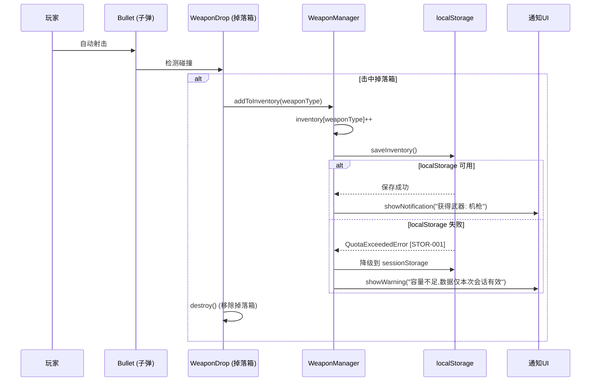

**关键数据结构**:
```javascript
// 库存数据 (localStorage key: 'monsterTide_weaponInventory')
{
  "rifle": 5,
  "rifle+": 1,
  "machinegun": 2,
  "shotgun": 3,
  // ... 其他武器
  "ultimate_laser": 0
}
```

**错误处理**:
- localStorage 不可用 → 降级到 sessionStorage
- 数据损坏 → 重置为默认库存 `{rifle: 1}`
- 容量超限 → 显示警告并清理过期数据

---

### 2.2 武器合成流程

**场景**: 玩家在武器管理弹窗中合成高级武器

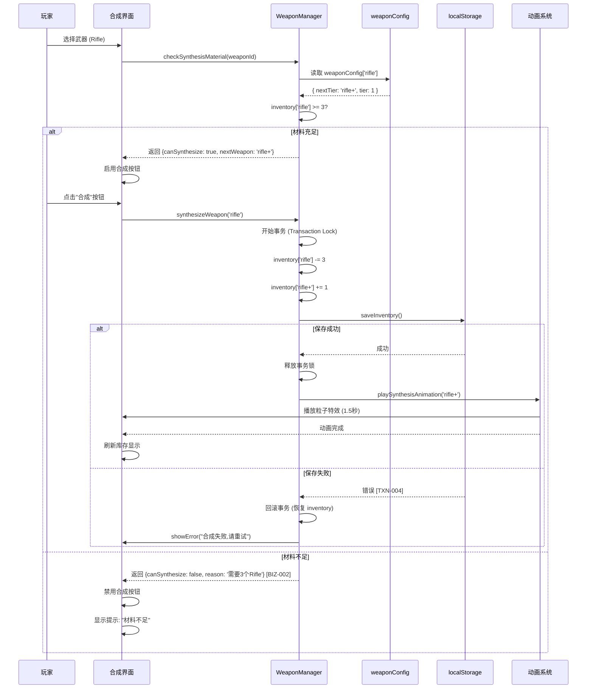

**关键逻辑**:
```javascript
// 合成事务 (原子操作)
function synthesizeWeapon(weaponId) {
    const config = weaponConfig[weaponId];
    const inventory = getInventory();

    // 1. 材料检查
    if (inventory[weaponId] < 3) {
        return { success: false, error: '材料不足' };
    }

    // 2. 检查是否最高级
    if (!config.nextTier) {
        return { success: false, error: '已是最高级武器' };
    }

    // 3. 检查是否为当前装备
    if (player.weapon.id === weaponId) {
        return { success: false, error: '无法合成当前装备的武器' };
    }

    // 4. 执行合成 (原子操作)
    try {
        inventory[weaponId] -= 3;
        inventory[config.nextTier] = (inventory[config.nextTier] || 0) + 1;
        saveInventory(inventory);
        return { success: true, result: config.nextTier };
    } catch (error) {
        // 回滚
        inventory[weaponId] += 3;
        inventory[config.nextTier] -= 1;
        throw error;
    }
}
```

**事务保护**:
- 合成中禁用按钮 (防止重复提交)
- 保存失败时回滚库存数据
- 使用事务锁防止并发合成

---

### 2.3 终极武器融合流程

**场景**: 玩家同时拥有 3 个 Super 级武器,融合为 Ultimate Laser

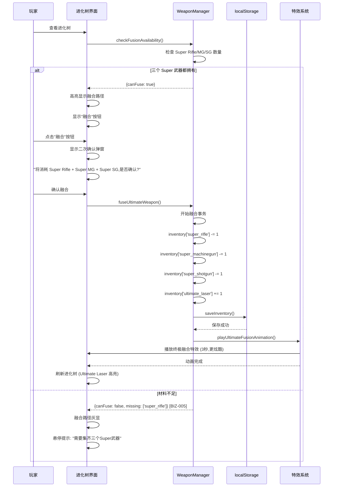

**融合规则**:
```javascript
// 终极融合逻辑
function fuseUltimateWeapon() {
    const inventory = getInventory();

    // 检查材料
    const hasSuperRifle = inventory['super_rifle'] >= 1;
    const hasSuperMG = inventory['super_machinegun'] >= 1;
    const hasSuperSG = inventory['super_shotgun'] >= 1;

    if (!hasSuperRifle || !hasSuperMG || !hasSuperSG) {
        return { success: false, error: '需要集齐三个Super武器' };
    }

    // 执行融合
    try {
        inventory['super_rifle'] -= 1;
        inventory['super_machinegun'] -= 1;
        inventory['super_shotgun'] -= 1;
        inventory['ultimate_laser'] = (inventory['ultimate_laser'] || 0) + 1;
        saveInventory(inventory);
        return { success: true };
    } catch (error) {
        // 回滚
        inventory['super_rifle'] += 1;
        inventory['super_machinegun'] += 1;
        inventory['super_shotgun'] += 1;
        inventory['ultimate_laser'] -= 1;
        throw error;
    }
}
```

---

### 2.4 波次间武器切换流程

**场景**: 波次结束后,玩家选择新武器装备

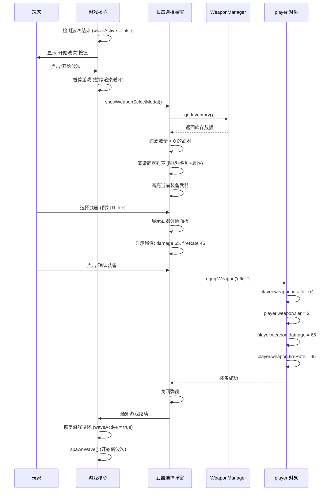

**关键点**:
- 仅波次间 (waveActive = false) 可切换武器
- 战斗中点击"武器管理"显示警告
- 未选择武器时保持当前装备
- 首次进入游戏默认装备 Rifle

**战斗中禁止切换流程**:
```javascript
// 战斗中尝试打开武器管理
function openWeaponModal() {
    if (game.waveActive) {
        showWarning('战斗中无法更换武器!');
        return false;
    }
    // 打开弹窗逻辑...
}
```

---

### 2.5 武器管理 UI 交互流程

**场景**: 玩家打开武器管理弹窗,浏览三个标签页

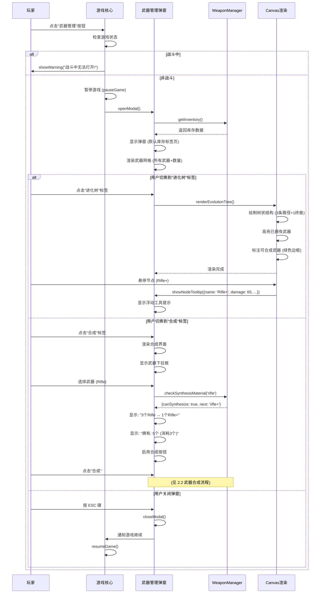

**UI 状态管理**:
```javascript
// 弹窗状态
const modalState = {
    isOpen: false,
    currentTab: 'inventory', // 'inventory' | 'tree' | 'synthesis'
    selectedWeapon: null,
    isAnimating: false // 合成动画播放中
};

// 标签页切换
function switchTab(tabName) {
    modalState.currentTab = tabName;

    switch(tabName) {
        case 'inventory':
            renderInventoryGrid();
            break;
        case 'tree':
            renderEvolutionTree();
            break;
        case 'synthesis':
            renderSynthesisPanel();
            break;
    }
}
```

---

## 3. localStorage 读写流程

### 3.1 数据加载流程 (游戏启动)

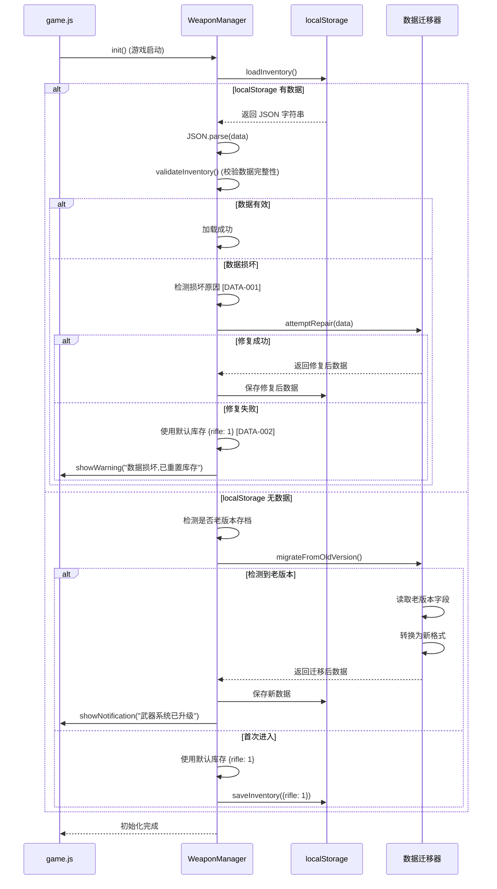

**数据校验逻辑**:
```javascript
// 校验库存数据完整性
function validateInventory(inventory) {
    // 1. 检查格式
    if (typeof inventory !== 'object' || inventory === null) {
        throw new Error('Invalid inventory format');
    }

    // 2. 检查武器 ID 合法性
    for (const weaponId in inventory) {
        if (!weaponConfig[weaponId]) {
            console.warn(`Unknown weapon: ${weaponId}, ignoring...`);
            delete inventory[weaponId];
        }
    }

    // 3. 检查数量合法性
    for (const weaponId in inventory) {
        if (typeof inventory[weaponId] !== 'number' || inventory[weaponId] < 0) {
            console.warn(`Invalid count for ${weaponId}, resetting to 0`);
            inventory[weaponId] = 0;
        }

        // 限制最大值 (防止数据异常)
        if (inventory[weaponId] > 999999) {
            inventory[weaponId] = 999999;
        }
    }

    // 4. 确保至少有1个Rifle
    if (!inventory.rifle || inventory.rifle < 1) {
        inventory.rifle = 1;
    }

    return inventory;
}
```

---

### 3.2 数据保存流程 (实时持久化)

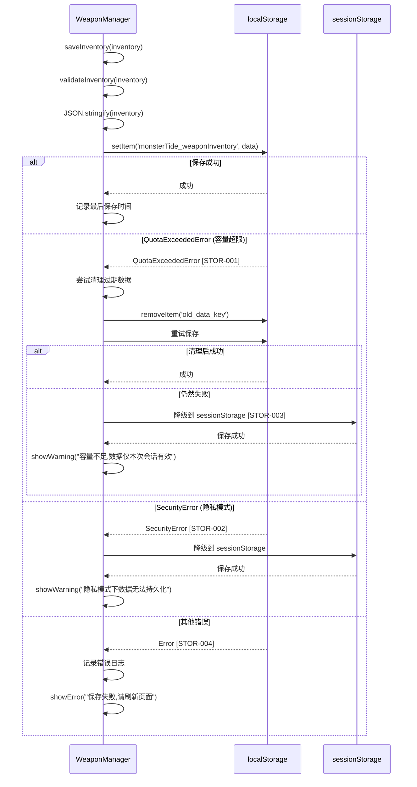

**容错保存逻辑**:
```javascript
class WeaponInventoryStorage {
    constructor() {
        this.storageKey = 'monsterTide_weaponInventory';
        this.versionKey = 'monsterTide_version';
        this.useSessionStorage = false;
    }

    save(inventory) {
        const data = JSON.stringify(inventory);
        const version = '2.0.0'; // 武器系统版本

        try {
            // 优先使用 localStorage
            if (!this.useSessionStorage) {
                localStorage.setItem(this.storageKey, data);
                localStorage.setItem(this.versionKey, version);
                console.log('[Storage] Saved to localStorage');
                return true;
            }
        } catch (e) {
            if (e.name === 'QuotaExceededError') {
                console.warn('[Storage] localStorage full, trying cleanup...');

                // 尝试清理过期数据
                this.cleanup();

                // 重试一次
                try {
                    localStorage.setItem(this.storageKey, data);
                    localStorage.setItem(this.versionKey, version);
                    return true;
                } catch (retryError) {
                    console.error('[Storage] Cleanup failed, fallback to sessionStorage');
                    this.useSessionStorage = true;
                }
            } else if (e.name === 'SecurityError') {
                console.warn('[Storage] SecurityError (privacy mode?), fallback to sessionStorage');
                this.useSessionStorage = true;
            } else {
                console.error('[Storage] Unknown error:', e);
                throw e;
            }
        }

        // 降级到 sessionStorage
        try {
            sessionStorage.setItem(this.storageKey, data);
            sessionStorage.setItem(this.versionKey, version);
            console.log('[Storage] Saved to sessionStorage (temporary)');
            showWarning('数据仅本次会话有效,请勿关闭标签页');
            return true;
        } catch (e) {
            console.error('[Storage] sessionStorage also failed:', e);
            showError('无法保存数据,请检查浏览器设置');
            return false;
        }
    }

    cleanup() {
        // 清理策略: 移除非关键数据
        const keysToRemove = [
            'monsterTide_old_data', // 老版本数据
            'monsterTide_temp_cache' // 临时缓存
        ];

        keysToRemove.forEach(key => {
            try {
                localStorage.removeItem(key);
            } catch (e) {
                // 忽略清理错误
            }
        });
    }
}
```

---

### 3.3 老存档迁移流程

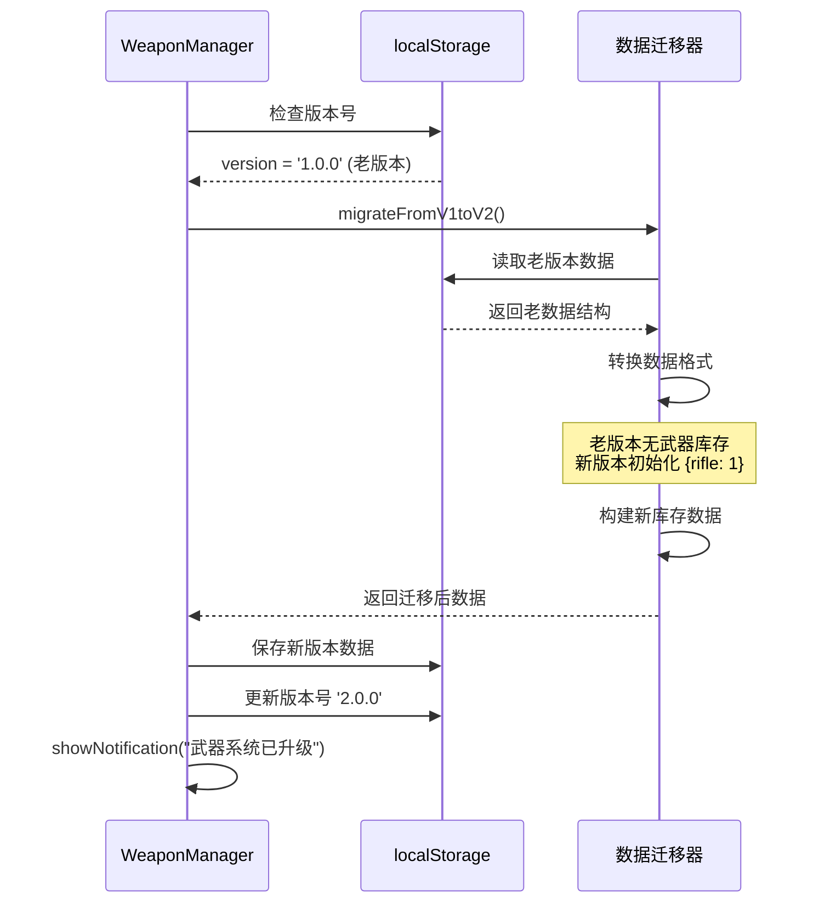

**迁移逻辑**:
```javascript
// 数据迁移器
class InventoryMigrator {
    migrate() {
        const version = localStorage.getItem('monsterTide_version') || '1.0.0';

        switch(version) {
            case '1.0.0':
                return this.migrateFromV1toV2();
            case '2.0.0':
                return null; // 无需迁移
            default:
                console.warn(`Unknown version: ${version}, resetting...`);
                return this.getDefaultInventory();
        }
    }

    migrateFromV1toV2() {
        console.log('[Migrator] Migrating from v1.0.0 to v2.0.0...');

        // 老版本无武器库存系统,初始化默认库存
        const defaultInventory = {
            rifle: 1 // 所有玩家初始有1个Rifle
        };

        // 检测老版本玩家是否有特殊成就 (可选逻辑)
        const oldAchievements = localStorage.getItem('monsterTide_achievements');
        if (oldAchievements) {
            try {
                const achievements = JSON.parse(oldAchievements);
                // 如果老玩家达成特定成就,奖励额外武器
                if (achievements.wave >= 10) {
                    defaultInventory.machinegun = 1;
                    console.log('[Migrator] Rewarded veteran player with Machinegun');
                }
            } catch (e) {
                console.error('[Migrator] Failed to parse achievements:', e);
            }
        }

        // 保存新版本数据
        localStorage.setItem('monsterTide_weaponInventory', JSON.stringify(defaultInventory));
        localStorage.setItem('monsterTide_version', '2.0.0');

        showNotification('武器系统已升级! 您的库存已初始化。');

        return defaultInventory;
    }

    getDefaultInventory() {
        return { rifle: 1 };
    }
}
```

---

## 4. 异常数据流

### 4.1 localStorage 损坏检测与修复

**场景**: 玩家手动修改 localStorage 或数据损坏

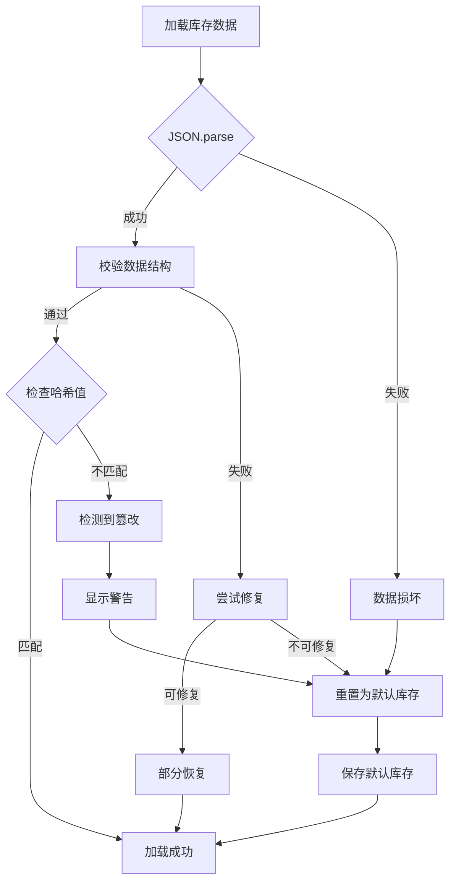

**哈希校验 (简单防篡改)**:
```javascript
// 简单哈希校验 (非安全性要求,仅防误操作)
class InventoryHasher {
    save(inventory) {
        const data = JSON.stringify(inventory);
        const checksum = this.simpleHash(data);

        const payload = { data: inventory, checksum };
        localStorage.setItem('monsterTide_weaponInventory', JSON.stringify(payload));
    }

    load() {
        const stored = localStorage.getItem('monsterTide_weaponInventory');
        if (!stored) return this.getDefaultInventory();

        try {
            const payload = JSON.parse(stored);

            // 校验哈希
            const dataString = JSON.stringify(payload.data);
            const expectedChecksum = this.simpleHash(dataString);

            if (payload.checksum === expectedChecksum) {
                console.log('[Hash] Inventory checksum valid');
                return payload.data;
            } else {
                console.warn('[Hash] Inventory checksum mismatch, data may be tampered');
                showWarning('检测到数据异常,已重置库存');
                return this.getDefaultInventory();
            }
        } catch (e) {
            console.error('[Hash] Failed to load inventory:', e);
            return this.getDefaultInventory();
        }
    }

    simpleHash(str) {
        // 简单的字符串哈希 (非加密级别)
        let hash = 0;
        for (let i = 0; i < str.length; i++) {
            const char = str.charCodeAt(i);
            hash = ((hash << 5) - hash) + char;
            hash = hash & hash; // 转为32位整数
        }
        return hash.toString(36); // Base36 编码
    }

    getDefaultInventory() {
        return { rifle: 1 };
    }
}
```

---

### 4.2 多标签页数据冲突检测

**场景**: 玩家同时在两个标签页打开游戏

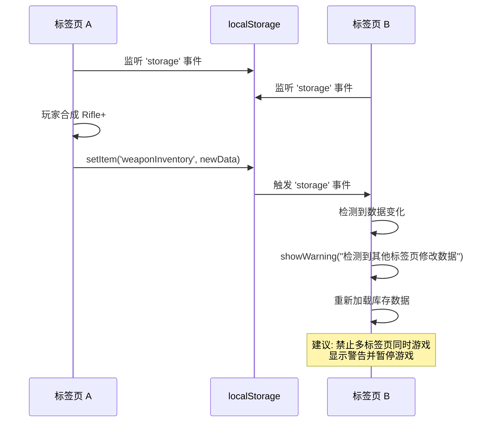

**多标签页冲突处理**:
```javascript
// 监听 localStorage 变化 (跨标签页)
window.addEventListener('storage', (event) => {
    if (event.key === 'monsterTide_weaponInventory') {
        console.warn('[MultiTab] Detected inventory change from another tab');

        showWarning('检测到其他标签页修改了数据,建议关闭其他标签页');

        // 重新加载库存数据
        const newInventory = weaponManager.loadInventory();

        // 刷新 UI
        if (weaponModal.isOpen) {
            weaponModal.refresh();
        }
    }
});

// 启动时检测多标签页
function detectMultipleInstances() {
    const instanceId = Date.now().toString(36);
    localStorage.setItem('monsterTide_instanceId', instanceId);

    setTimeout(() => {
        const currentId = localStorage.getItem('monsterTide_instanceId');
        if (currentId !== instanceId) {
            showWarning('检测到多个标签页同时运行游戏,可能导致数据不同步');
            // 可选: 禁止多标签页运行
            // pauseGame();
        }
    }, 100);
}
```

---

## 5. 性能优化

### 5.1 localStorage 读写优化

**防抖保存** (避免频繁写入):
```javascript
class OptimizedStorage {
    constructor() {
        this.pendingSave = null;
        this.saveDelay = 300; // 300ms 防抖
    }

    save(inventory) {
        // 取消之前的保存任务
        if (this.pendingSave) {
            clearTimeout(this.pendingSave);
        }

        // 延迟保存 (防抖)
        this.pendingSave = setTimeout(() => {
            this.doSave(inventory);
            this.pendingSave = null;
        }, this.saveDelay);
    }

    doSave(inventory) {
        // 实际保存逻辑...
        localStorage.setItem('monsterTide_weaponInventory', JSON.stringify(inventory));
    }

    // 立即保存 (关键操作)
    saveNow(inventory) {
        if (this.pendingSave) {
            clearTimeout(this.pendingSave);
            this.pendingSave = null;
        }
        this.doSave(inventory);
    }
}
```

---

### 5.2 进化树渲染优化

**离屏 Canvas 缓存**:
```javascript
class EvolutionTreeRenderer {
    constructor() {
        this.cachedCanvas = null;
        this.cachedInventory = null;
    }

    render(inventory) {
        // 检查库存是否变化
        const inventoryHash = JSON.stringify(inventory);

        if (this.cachedInventory === inventoryHash && this.cachedCanvas) {
            // 使用缓存
            ctx.drawImage(this.cachedCanvas, 0, 0);
            return;
        }

        // 重新渲染
        const offscreen = document.createElement('canvas');
        offscreen.width = 800;
        offscreen.height = 600;
        const offCtx = offscreen.getContext('2d');

        // 绘制进化树...
        this.drawTree(offCtx, inventory);

        // 缓存结果
        this.cachedCanvas = offscreen;
        this.cachedInventory = inventoryHash;

        // 显示
        ctx.drawImage(offscreen, 0, 0);
    }
}
```

---

## 5.5 存档数据迁移流程 (ISS-L1C-005)

**场景**: 游戏从旧版本（无武器进化系统）升级到新版本（有武器进化系统），需要迁移玩家已有存档数据。

**版本迁移矩阵**:

| 旧版本 | 新版本 | 迁移策略 |
|--------|--------|----------|
| 无存档 | v2.0.0 | 初始化默认库存 `{rifle: 1}` |
| v1.x (旧格式字符串) | v2.0.0 | 解析旧格式 → 转换为新格式 |
| v2.0.0+ | v2.x.x | 按 schema 版本号增量迁移 |

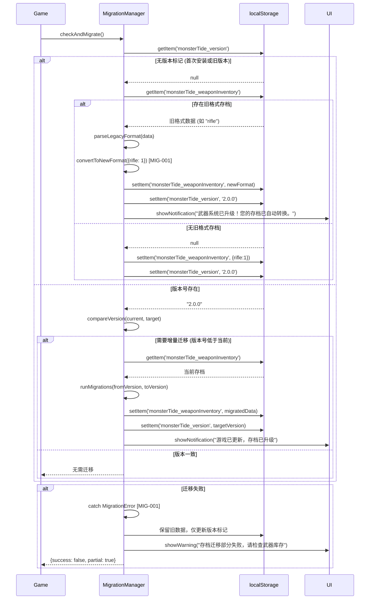

**迁移时机**: `game.js` 初始化时，在 `WeaponManager.init()` 之前执行。

**回滚策略**: 迁移前备份旧数据到 `monsterTide_weaponInventory_backup`，迁移失败时可恢复。

---

## 5.6 数据 Schema 版本化策略 (ISS-L1C-010)

### 5.6.1 版本号格式

**采用 Semantic Versioning (major.minor.patch)**:
- **Major**: 数据结构 breaking change（如 weaponInventory schema 变更）
- **Minor**: 向后兼容的功能新增（如新增武器类型）
- **Patch**: Bug 修复，不影响数据结构

**当前版本**: v2.0.0（武器进化系统首个版本）

**存储位置**: `localStorage.setItem('monsterTide_version', '2.0.0')`

---

### 5.6.2 版本兼容性矩阵

| 数据版本 | 游戏版本 | 兼容性 | 迁移策略 |
|---------|---------|-------|---------|
| 无 | v1.x | ✅ 向后兼容 | 自动迁移为 v2.0.0 + 初始化库存 |
| v1.0.0 | v1.x | ✅ 向后兼容 | 自动迁移为 v2.0.0 + 保留成就奖励 |
| v2.0.0 | v2.x | ✅ 完全兼容 | 无需迁移 |
| v2.1.0 | v2.x | ✅ 向前兼容 | v2.0 可读取 v2.1 数据（忽略新字段） |
| v3.0.0 | v3.x | ⚠️ Breaking | 需要新迁移脚本 v2.x → v3.x |

---

### 5.6.3 升级/降级路径

**升级路径（向上兼容）**:
```
v1.x → v2.0.0 → v2.1.0 → v2.2.0 → v3.0.0
```

**降级路径（有限支持）**:
- v2.x → v2.y: 安全（同 major 版本内）
- v2.x → v1.x: ❌ 不支持（数据结构不兼容，显示警告）
- v3.x → v2.x: ⚠️ 有限支持（需手动迁移脚本）

---

### 5.6.4 Breaking Change 定义

| 变更类型 | Breaking? | Major 版本升级 | 示例 |
|---------|----------|--------------|------|
| 移除字段 | ✅ Breaking | 是 | 移除 `weaponTypes.duration` |
| 修改字段类型 | ✅ Breaking | 是 | `tier: string → number` |
| 重命名字段 | ✅ Breaking | 是 | `weapon.type → weapon.id` |
| 新增必填字段 | ✅ Breaking | 是 | 新增 `weaponInventory.schemaVersion` (必填) |
| 新增可选字段 | ❌ Non-Breaking | 否 | 新增 `weapon.specialEffect` (可选) |
| 修改字段默认值 | ❌ Non-Breaking | 否 | `tier 默认值: 0 → 1` |
| 修改错误提示文案 | ❌ Non-Breaking | 否 | "材料不足" → "需要3个武器才能合成" |

---

### 5.6.5 版本检测与迁移流程

```javascript
class SchemaVersionManager {
    constructor() {
        this.currentVersion = '2.0.0';
        this.versionKey = 'monsterTide_version';
    }

    checkAndMigrate() {
        const storedVersion = localStorage.getItem(this.versionKey);

        if (!storedVersion) {
            // 无版本标记：老版本或首次安装
            console.log('[Schema] No version found, treating as v1.x');
            return this.migrateFromV1();
        }

        const comparison = this.compareVersions(storedVersion, this.currentVersion);

        if (comparison < 0) {
            // 存档版本低于当前版本：需要升级
            console.log(`[Schema] Upgrading from ${storedVersion} to ${this.currentVersion}`);
            return this.upgrade(storedVersion, this.currentVersion);
        } else if (comparison > 0) {
            // 存档版本高于当前版本：不兼容
            console.warn(`[Schema] Data version ${storedVersion} is newer than game version ${this.currentVersion}`);
            throw new Error(`数据版本过高（${storedVersion}），请升级游戏到最新版本`);
        } else {
            // 版本一致：无需迁移
            return { migrated: false };
        }
    }

    compareVersions(v1, v2) {
        const parts1 = v1.split('.').map(Number);
        const parts2 = v2.split('.').map(Number);

        for (let i = 0; i < 3; i++) {
            if (parts1[i] > parts2[i]) return 1;
            if (parts1[i] < parts2[i]) return -1;
        }
        return 0;
    }

    upgrade(fromVersion, toVersion) {
        const migrations = this.getMigrationChain(fromVersion, toVersion);

        for (const migration of migrations) {
            console.log(`[Schema] Running migration: ${migration.name}`);
            migration.execute();
        }

        localStorage.setItem(this.versionKey, toVersion);
        return { migrated: true, from: fromVersion, to: toVersion };
    }

    getMigrationChain(from, to) {
        // 定义迁移链
        const allMigrations = [
            { from: '1.0.0', to: '2.0.0', name: 'v1-to-v2', execute: this.migrateV1toV2 },
            { from: '2.0.0', to: '2.1.0', name: 'v2.0-to-v2.1', execute: this.migrateV2_0toV2_1 }
        ];

        // 查找适用的迁移路径
        return allMigrations.filter(m => {
            const fromComp = this.compareVersions(m.from, from);
            const toComp = this.compareVersions(m.to, to);
            return fromComp >= 0 && toComp <= 0;
        });
    }
}
```

---

### 5.6.6 弃用策略 (Deprecation Policy)

**弃用流程**:
1. **标记弃用** (v2.1.0): 字段标注 `@deprecated`，控制台警告
2. **保留兼容** (v2.x): 2 个 minor 版本内继续支持
3. **移除字段** (v3.0.0): 下一 major 版本移除

**示例**:
```javascript
// v2.1.0: 标记 duration 弃用
if (weapon.duration !== undefined) {
    console.warn('[Deprecated] weapon.duration is deprecated since v2.0.0, will be removed in v3.0.0');
}

// v2.2.0: 仍然支持（兼容期）
// v3.0.0: 移除 duration 支持
```

---

## 6. 数据流总结

### 关键路径
1. **武器收集**: WeaponDrop → WeaponManager → localStorage
2. **武器合成**: UI → WeaponManager (事务) → localStorage → 动画
3. **武器切换**: 波次间 → 选择界面 → player.weapon
4. **UI 交互**: 三标签页 → 实时库存同步

### 容错机制
- localStorage 失败 → sessionStorage 降级
- 数据损坏 → 哈希校验 + 自动修复
- 多标签页 → 冲突检测 + 警告
- 事务失败 → 回滚机制

### 性能优化
- 防抖保存 (300ms)
- 离屏 Canvas 缓存
- 事件监听优化

---

**文档状态**: 草案 (Draft)
**下一步**: 提交技术评审,结合 error-strategy.md 完善容错逻辑
