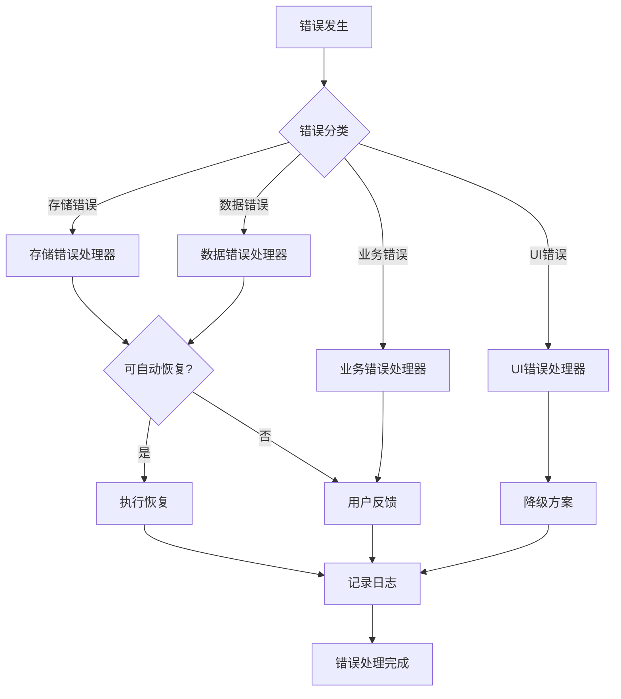

# 错误处理策略

## 1. 概述

本文档定义武器进化系统的分层错误处理策略,包括:
- 错误分类与分级
- 分层错误处理 (表示层/应用层/数据层)
- 错误码体系
- 用户反馈策略
- 日志与监控

**设计原则**:
- **用户友好**: 错误信息清晰易懂,提供明确的解决方案
- **静默降级**: 非关键错误不中断游戏体验
- **快速失败**: 关键错误立即暴露,避免数据损坏
- **可恢复性**: 所有错误提供恢复路径

---

## 2. 错误分类与分级

### 2.1 错误分类

| 分类 | 说明 | 示例 |
|------|------|------|
| **存储错误** | localStorage/sessionStorage 相关 | QuotaExceededError, SecurityError |
| **数据错误** | 数据格式/完整性/一致性问题 | JSON 解析失败, 数据损坏, 哈希校验失败 |
| **业务错误** | 业务规则违反 | 材料不足, 装备武器被合成, 最高级武器无法升级 |
| **UI错误** | 界面交互错误 | Canvas 渲染失败, 动画异常 |
| **并发错误** | 多标签页/事务冲突 | 事务锁冲突, 多标签页数据不同步 |
| **安全错误** | 数据完整性校验失败 | 哈希校验不通过, 检测到手动篡改 |
| **兼容性错误** | 浏览器兼容性问题 | localStorage不可用, 隐私模式限制 |

---

### 2.2 错误等级

| 等级 | 说明 | 处理策略 | 用户反馈 |
|------|------|---------|---------|
| **CRITICAL** | 致命错误,无法继续游戏 | 中断游戏,显示错误页面,提供恢复选项 | 弹窗提示 + 解决方案 |
| **ERROR** | 严重错误,功能不可用 | 禁用相关功能,记录日志,提示用户 | Toast 提示 + 错误码 |
| **WARNING** | 警告,可能影响体验 | 降级处理,记录日志,轻提示 | Toast 提示 (自动消失) |
| **INFO** | 信息性提示 | 仅记录日志,不影响功能 | 控制台日志 |

---

## 3. 分层错误处理

### 3.1 表示层错误 (UI Layer)

**职责**: 处理用户交互错误,提供友好反馈

#### 3.1.1 Canvas 渲染错误

**场景**: 进化树 Canvas 绘制失败

```javascript
class EvolutionTreeRenderer {
    render(inventory) {
        try {
            const canvas = document.getElementById('evolution-tree-canvas');
            if (!canvas) {
                throw new UIError('Canvas element not found', 'UI-001');
            }

            const ctx = canvas.getContext('2d');
            if (!ctx) {
                throw new UIError('Canvas 2D context not supported', 'UI-002');
            }

            // 绘制进化树...
            this.drawTree(ctx, inventory);

        } catch (error) {
            if (error instanceof UIError) {
                console.error('[UI] Rendering failed:', error);

                // 降级方案: 显示文本版进化树
                this.renderTextFallback(inventory);

                showWarning('进化树渲染失败,已切换到简化模式');
            } else {
                // 未预期的错误,重新抛出
                throw error;
            }
        }
    }

    renderTextFallback(inventory) {
        // 文本版进化树 (HTML列表)
        const container = document.getElementById('evolution-tree-container');
        container.innerHTML = `
            <div class="tree-text-fallback">
                <h3>武器进化路径</h3>
                <ul>
                    <li>步枪线: Rifle → Rifle+ → Rifle++ → Super Rifle</li>
                    <li>机枪线: Machinegun → MG+ → MG++ → Super MG</li>
                    <li>霰弹枪线: Shotgun → SG+ → SG++ → Super SG</li>
                    <li>终极武器: 3个Super → Ultimate Laser</li>
                </ul>
            </div>
        `;
    }
}
```

**错误码**:
- `UI-001`: Canvas 元素未找到
- `UI-002`: 浏览器不支持 Canvas 2D
- `UI-003`: 动画帧率过低 (< 30fps)

---

#### 3.1.2 用户输入错误

**场景**: 用户在战斗中尝试打开武器管理

```javascript
function openWeaponModal() {
    try {
        // 检查游戏状态
        if (game.waveActive) {
            throw new BusinessError('战斗中无法打开武器管理', 'BIZ-001');
        }

        // 检查库存是否加载
        if (!weaponManager.isInitialized()) {
            throw new DataError('武器库存未初始化', 'DATA-001');
        }

        // 打开弹窗
        modalManager.open('weapon-management');

    } catch (error) {
        if (error instanceof BusinessError) {
            // 业务规则错误,显示友好提示
            showWarning(error.message);
            console.warn('[UI]', error);
        } else if (error instanceof DataError) {
            // 数据错误,尝试重新初始化
            console.error('[UI] Data error:', error);
            showError('数据加载失败,请刷新页面');
        } else {
            // 未知错误
            console.error('[UI] Unexpected error:', error);
            showError('发生未知错误,请联系开发者');
        }
    }
}
```

---

### 3.2 应用层错误 (Business Logic Layer)

**职责**: 处理业务逻辑错误,确保数据一致性

#### 3.2.1 合成逻辑错误

**场景**: 材料不足、装备武器被合成、最高级武器

```javascript
class WeaponSynthesizer {
    synthesize(weaponId) {
        try {
            // 1. 材料检查
            const inventory = weaponManager.getInventory();
            const weaponCount = inventory[weaponId] || 0;

            if (weaponCount < 3) {
                throw new BusinessError(
                    `材料不足: 需要3个${weaponConfig[weaponId].name},当前拥有${weaponCount}个`,
                    'BIZ-002',
                    { required: 3, current: weaponCount }
                );
            }

            // 2. 检查是否为当前装备
            if (player.weapon.id === weaponId) {
                throw new BusinessError(
                    '无法合成当前装备的武器,请先切换到其他武器',
                    'BIZ-003',
                    { equippedWeapon: weaponId }
                );
            }

            // 3. 检查是否为最高级
            const config = weaponConfig[weaponId];
            if (!config.nextTier) {
                throw new BusinessError(
                    `${config.name}已是最高级武器,无法继续合成`,
                    'BIZ-004',
                    { weaponId }
                );
            }

            // 4. 执行合成事务
            const result = this.doSynthesize(weaponId, config.nextTier);
            return result;

        } catch (error) {
            if (error instanceof BusinessError) {
                // 业务错误,友好提示
                console.warn('[Synthesis]', error.message);
                showWarning(error.message);
                return { success: false, error: error.message, code: error.code };
            } else {
                // 未预期错误,记录并抛出
                console.error('[Synthesis] Unexpected error:', error);
                throw error;
            }
        }
    }

    doSynthesize(sourceId, targetId) {
        const transaction = new SynthesisTransaction(sourceId, targetId);

        try {
            transaction.begin();
            transaction.deductMaterial(3); // 消耗3个原材料
            transaction.addProduct(1);     // 增加1个产物
            transaction.commit();          // 提交事务

            return { success: true, result: targetId };

        } catch (error) {
            transaction.rollback(); // 回滚事务
            throw error;
        }
    }
}
```

**错误码**:
- `BIZ-001`: 战斗中禁止操作
- `BIZ-002`: 材料不足
- `BIZ-003`: 装备武器禁止合成
- `BIZ-004`: 最高级武器无法合成
- `BIZ-005`: 终极融合材料不足

---

#### 3.2.2 事务错误处理

**场景**: 合成事务执行失败,需要回滚

```javascript
class SynthesisTransaction {
    constructor(sourceId, targetId) {
        this.sourceId = sourceId;
        this.targetId = targetId;
        this.snapshot = null; // 事务快照
        this.isActive = false;
    }

    begin() {
        if (this.isActive) {
            throw new TransactionError('事务已激活', 'TXN-001');
        }

        // 保存快照
        this.snapshot = weaponManager.getInventory();
        this.isActive = true;
        console.log('[Transaction] Begin:', this.sourceId, '->', this.targetId);
    }

    deductMaterial(count) {
        if (!this.isActive) {
            throw new TransactionError('事务未激活', 'TXN-002');
        }

        const inventory = weaponManager.getInventory();
        if ((inventory[this.sourceId] || 0) < count) {
            throw new TransactionError(
                `事务执行失败: ${this.sourceId} 数量不足`,
                'TXN-003'
            );
        }

        inventory[this.sourceId] -= count;
    }

    addProduct(count) {
        if (!this.isActive) {
            throw new TransactionError('事务未激活', 'TXN-002');
        }

        const inventory = weaponManager.getInventory();
        inventory[this.targetId] = (inventory[this.targetId] || 0) + count;
    }

    commit() {
        if (!this.isActive) {
            throw new TransactionError('事务未激活', 'TXN-002');
        }

        try {
            // 保存到 localStorage
            weaponManager.saveInventory();
            this.isActive = false;
            this.snapshot = null;
            console.log('[Transaction] Committed');

        } catch (error) {
            console.error('[Transaction] Commit failed:', error);
            this.rollback();
            throw new TransactionError(
                '事务提交失败,已回滚',
                'TXN-004',
                { originalError: error }
            );
        }
    }

    rollback() {
        if (!this.isActive) {
            console.warn('[Transaction] Rollback called on inactive transaction');
            return;
        }

        // 恢复快照
        weaponManager.setInventory(this.snapshot);
        this.isActive = false;
        this.snapshot = null;
        console.warn('[Transaction] Rolled back');
    }
}
```

**错误码**:
- `TXN-001`: 事务重复激活
- `TXN-002`: 事务未激活
- `TXN-003`: 事务执行失败 (数据不一致)
- `TXN-004`: 事务提交失败

---

### 3.3 数据层错误 (Data Layer)

**职责**: 处理 localStorage 读写错误,确保数据可靠性

#### 3.3.1 localStorage 存储错误

**场景**: QuotaExceededError, SecurityError

```javascript
class WeaponInventoryStorage {
    save(inventory) {
        try {
            const data = JSON.stringify(inventory);
            const payload = this.addChecksum(data);

            // 尝试保存到 localStorage
            localStorage.setItem(this.storageKey, JSON.stringify(payload));
            console.log('[Storage] Saved to localStorage');
            return { success: true, storage: 'localStorage' };

        } catch (error) {
            return this.handleSaveError(error, inventory);
        }
    }

    handleSaveError(error, inventory) {
        if (error.name === 'QuotaExceededError') {
            console.warn('[Storage] QuotaExceededError, trying cleanup...');

            // 错误码: STOR-001
            const cleaned = this.cleanupStorage();

            if (cleaned) {
                // 清理成功,重试保存
                try {
                    localStorage.setItem(this.storageKey, JSON.stringify(inventory));
                    showInfo('已清理过期数据');
                    return { success: true, storage: 'localStorage' };
                } catch (retryError) {
                    console.error('[Storage] Retry failed:', retryError);
                }
            }

            // 降级到 sessionStorage
            return this.fallbackToSession(inventory, 'STOR-001');

        } else if (error.name === 'SecurityError') {
            console.warn('[Storage] SecurityError (privacy mode?)');

            // 错误码: STOR-002
            return this.fallbackToSession(inventory, 'STOR-002');

        } else {
            // 未知错误
            console.error('[Storage] Unknown save error:', error);

            // 错误码: STOR-003
            showError('数据保存失败,请刷新页面重试');
            return {
                success: false,
                error: 'STOR-003',
                message: '数据保存失败',
                originalError: error
            };
        }
    }

    fallbackToSession(inventory, errorCode) {
        try {
            sessionStorage.setItem(this.storageKey, JSON.stringify(inventory));
            console.warn('[Storage] Fallback to sessionStorage');

            showWarning(
                '数据仅本次会话有效,关闭标签页后将丢失。\n' +
                '建议退出隐私模式或清理浏览器缓存。'
            );

            return {
                success: true,
                storage: 'sessionStorage',
                warning: errorCode
            };

        } catch (sessionError) {
            console.error('[Storage] sessionStorage also failed:', sessionError);

            showError(
                '无法保存数据!\n' +
                '请检查浏览器设置,确保存储功能未被禁用。'
            );

            return {
                success: false,
                error: 'STOR-004',
                message: 'sessionStorage 也不可用'
            };
        }
    }

    cleanupStorage() {
        try {
            // 清理策略: 移除非关键数据
            const keysToRemove = [
                'monsterTide_old_data',
                'monsterTide_temp_cache',
                'monsterTide_debug_logs'
            ];

            let cleaned = false;
            keysToRemove.forEach(key => {
                if (localStorage.getItem(key)) {
                    localStorage.removeItem(key);
                    cleaned = true;
                }
            });

            return cleaned;

        } catch (error) {
            console.error('[Storage] Cleanup failed:', error);
            return false;
        }
    }
}
```

**错误码**:
- `STOR-001`: localStorage 容量超限 (QuotaExceededError)
- `STOR-002`: localStorage 禁用 (SecurityError,隐私模式)
- `STOR-003`: localStorage 未知错误
- `STOR-004`: sessionStorage 也不可用

---

#### 3.3.2 数据损坏错误

**场景**: JSON 解析失败、数据格式异常、哈希校验失败

```javascript
class WeaponInventoryLoader {
    load() {
        try {
            const stored = localStorage.getItem(this.storageKey);

            if (!stored) {
                console.log('[Loader] No data found, initializing default inventory');
                return this.getDefaultInventory();
            }

            // 1. JSON 解析
            let payload;
            try {
                payload = JSON.parse(stored);
            } catch (parseError) {
                throw new DataError(
                    'JSON 解析失败,数据已损坏',
                    'DATA-002',
                    { originalError: parseError }
                );
            }

            // 2. 哈希校验
            if (payload.checksum) {
                const dataString = JSON.stringify(payload.data);
                const expectedChecksum = this.calculateChecksum(dataString);

                if (payload.checksum !== expectedChecksum) {
                    throw new DataError(
                        '数据校验失败,检测到篡改',
                        'DATA-003',
                        { expected: expectedChecksum, actual: payload.checksum }
                    );
                }
            }

            // 3. 数据格式校验
            const inventory = payload.data || payload; // 兼容老格式
            this.validateInventory(inventory);

            console.log('[Loader] Inventory loaded successfully');
            return inventory;

        } catch (error) {
            return this.handleLoadError(error);
        }
    }

    handleLoadError(error) {
        if (error instanceof DataError) {
            console.error('[Loader]', error.message, error.code);

            // 尝试修复
            if (error.code === 'DATA-002' || error.code === 'DATA-003') {
                const repaired = this.attemptRepair(error);

                if (repaired) {
                    showWarning('数据已自动修复');
                    return repaired;
                }
            }

            // 修复失败,重置为默认库存
            showError(
                '数据损坏无法恢复,已重置为初始库存。\n' +
                '您的进度可能丢失,我们深表歉意。'
            );

            const defaultInventory = this.getDefaultInventory();
            this.save(defaultInventory); // 保存默认库存
            return defaultInventory;

        } else {
            // 未知错误
            console.error('[Loader] Unknown load error:', error);
            showError('数据加载失败,请刷新页面');
            return this.getDefaultInventory();
        }
    }

    validateInventory(inventory) {
        // 格式检查
        if (typeof inventory !== 'object' || inventory === null) {
            throw new DataError('库存格式无效', 'DATA-004');
        }

        // 武器 ID 合法性
        for (const weaponId in inventory) {
            if (!weaponConfig[weaponId]) {
                console.warn(`[Loader] Unknown weapon: ${weaponId}, removing...`);
                delete inventory[weaponId];
            }
        }

        // 数量合法性
        for (const weaponId in inventory) {
            const count = inventory[weaponId];

            if (typeof count !== 'number' || count < 0) {
                console.warn(`[Loader] Invalid count for ${weaponId}: ${count}, resetting to 0`);
                inventory[weaponId] = 0;
            }

            if (count > 999999) {
                console.warn(`[Loader] Count too large for ${weaponId}: ${count}, capping to 999999`);
                inventory[weaponId] = 999999;
            }
        }

        // 确保至少有 1 个 Rifle
        if (!inventory.rifle || inventory.rifle < 1) {
            console.warn('[Loader] No rifle found, adding default');
            inventory.rifle = 1;
        }
    }

    attemptRepair(error) {
        try {
            console.log('[Loader] Attempting to repair data...');

            // 读取原始数据
            const stored = localStorage.getItem(this.storageKey);
            if (!stored) return null;

            // 尝试多种解析策略
            // 策略1: 移除哈希校验,直接解析数据
            const payload = JSON.parse(stored);
            if (payload.data) {
                console.log('[Loader] Repair: Ignoring checksum, using data field');
                this.validateInventory(payload.data);
                return payload.data;
            }

            // 策略2: 假设整个对象就是库存
            console.log('[Loader] Repair: Treating entire payload as inventory');
            this.validateInventory(payload);
            return payload;

        } catch (repairError) {
            console.error('[Loader] Repair failed:', repairError);
            return null;
        }
    }

    getDefaultInventory() {
        return { rifle: 1 };
    }
}
```

**错误码**:
- `DATA-001`: 库存未初始化
- `DATA-002`: JSON 解析失败
- `DATA-003`: 哈希校验失败 (数据篡改)
- `DATA-004`: 库存格式无效

---

#### 3.3.3 版本迁移错误

**场景**: 老版本存档迁移失败

```javascript
class InventoryMigrator {
    migrate() {
        try {
            const version = localStorage.getItem('monsterTide_version') || '1.0.0';

            console.log(`[Migrator] Detected version: ${version}`);

            switch(version) {
                case '1.0.0':
                    return this.migrateFromV1toV2();
                case '2.0.0':
                    return null; // 无需迁移
                default:
                    throw new MigrationError(
                        `未知版本: ${version}`,
                        'MIG-001',
                        { version }
                    );
            }

        } catch (error) {
            return this.handleMigrationError(error);
        }
    }

    migrateFromV1toV2() {
        try {
            console.log('[Migrator] Migrating from v1.0.0 to v2.0.0...');

            // 老版本无武器库存系统,初始化默认库存
            const defaultInventory = { rifle: 1 };

            // 可选: 奖励老玩家
            const oldAchievements = localStorage.getItem('monsterTide_achievements');
            if (oldAchievements) {
                const achievements = JSON.parse(oldAchievements);
                if (achievements.wave >= 10) {
                    defaultInventory.machinegun = 1;
                    console.log('[Migrator] Rewarded veteran player');
                }
            }

            // 保存新版本数据
            localStorage.setItem('monsterTide_weaponInventory', JSON.stringify(defaultInventory));
            localStorage.setItem('monsterTide_version', '2.0.0');

            showNotification('武器系统已升级!您的库存已初始化。');

            return defaultInventory;

        } catch (error) {
            throw new MigrationError(
                '迁移失败',
                'MIG-002',
                { originalError: error }
            );
        }
    }

    handleMigrationError(error) {
        if (error instanceof MigrationError) {
            console.error('[Migrator]', error.message, error.code);

            showError(
                '存档迁移失败,已重置为初始库存。\n' +
                '如果您是老玩家,我们深表歉意。'
            );

            // 重置为默认库存
            const defaultInventory = { rifle: 1 };
            localStorage.setItem('monsterTide_weaponInventory', JSON.stringify(defaultInventory));
            localStorage.setItem('monsterTide_version', '2.0.0');

            return defaultInventory;

        } else {
            console.error('[Migrator] Unexpected error:', error);
            throw error;
        }
    }
}
```

**错误码**:
- `MIG-001`: 未知版本号
- `MIG-002`: 迁移执行失败
- `MIG-003`: 迁移后数据无效

---

## 4. 并发错误处理

### 4.1 多标签页冲突

**场景**: 两个标签页同时修改库存

```javascript
class MultiTabGuard {
    constructor() {
        this.instanceId = Date.now().toString(36);
        this.hasWarned = false;
    }

    init() {
        // 监听 storage 事件
        window.addEventListener('storage', (event) => {
            this.handleStorageChange(event);
        });

        // 启动时检测
        this.detectMultipleInstances();
    }

    handleStorageChange(event) {
        if (event.key === 'monsterTide_weaponInventory') {
            console.warn('[MultiTab] Detected inventory change from another tab');

            if (!this.hasWarned) {
                showWarning(
                    '检测到其他标签页修改了武器库存!\n' +
                    '建议关闭其他标签页,避免数据不同步。'
                );
                this.hasWarned = true;
            }

            // 重新加载库存
            try {
                const newInventory = weaponManager.loadInventory();

                // 刷新 UI
                if (weaponModal.isOpen) {
                    weaponModal.refresh();
                }

            } catch (error) {
                console.error('[MultiTab] Failed to reload inventory:', error);
                showError('数据同步失败,请刷新页面');
            }
        }
    }

    detectMultipleInstances() {
        // 写入实例 ID
        localStorage.setItem('monsterTide_instanceId', this.instanceId);

        // 延迟检查 (避免竞态条件)
        setTimeout(() => {
            const currentId = localStorage.getItem('monsterTide_instanceId');

            if (currentId !== this.instanceId) {
                console.warn('[MultiTab] Detected multiple game instances');

                showWarning(
                    '检测到多个标签页同时运行游戏!\n' +
                    '可能导致数据不同步,建议仅保留一个标签页。'
                );

                // 可选: 禁止多标签页运行
                // this.disableGame();
            }
        }, 100);
    }

    disableGame() {
        console.error('[MultiTab] Disabling game due to multiple instances');

        showError(
            '检测到多个标签页同时运行游戏,已禁用当前标签页。\n' +
            '请关闭其他标签页后刷新。'
        );

        // 暂停游戏
        game.paused = true;
        game.disabled = true;
    }
}
```

**错误码**:
- `CONC-001`: 多标签页冲突
- `CONC-002`: 事务锁超时
- `CONC-003`: 并发合成冲突

---

### 4.2 事务锁超时

**场景**: 合成事务执行时间过长

```javascript
class SynthesisTransaction {
    constructor(sourceId, targetId, timeout = 5000) {
        this.sourceId = sourceId;
        this.targetId = targetId;
        this.timeout = timeout;
        this.timeoutHandle = null;
    }

    begin() {
        // 设置超时
        this.timeoutHandle = setTimeout(() => {
            console.error('[Transaction] Timeout after', this.timeout, 'ms');

            showError('合成超时,已自动回滚');
            this.rollback();

            throw new TransactionError(
                '事务超时',
                'CONC-002',
                { timeout: this.timeout }
            );

        }, this.timeout);

        // ... 其他逻辑
    }

    commit() {
        // 清除超时
        if (this.timeoutHandle) {
            clearTimeout(this.timeoutHandle);
            this.timeoutHandle = null;
        }

        // ... 提交逻辑
    }

    rollback() {
        // 清除超时
        if (this.timeoutHandle) {
            clearTimeout(this.timeoutHandle);
            this.timeoutHandle = null;
        }

        // ... 回滚逻辑
    }
}
```

---

## 5. 错误码体系

### 5.1 错误码格式

**格式**: `<CATEGORY>-<NUMBER>`

**分类前缀**:
- `UI`: 界面错误 (UI-001 ~ UI-099)
- `BIZ`: 业务逻辑错误 (BIZ-001 ~ BIZ-099)
- `STOR`: 存储错误 (STOR-001 ~ STOR-099)
- `DATA`: 数据错误 (DATA-001 ~ DATA-099)
- `TXN`: 事务错误 (TXN-001 ~ TXN-099)
- `MIG`: 迁移错误 (MIG-001 ~ MIG-099)
- `CONC`: 并发错误 (CONC-001 ~ CONC-099)
- `SEC`: 安全错误 (SEC-001 ~ SEC-099)
- `COMPAT`: 兼容性错误 (COMPAT-001 ~ COMPAT-099)

---

### 5.2 错误码清单

| 错误码 | 说明 | 等级 | 用户反馈 | 恢复策略 |
|--------|------|------|---------|---------|
| **UI-001** | Canvas 元素未找到 | ERROR | "进化树渲染失败" | 降级到文本模式 |
| **UI-002** | Canvas 2D 不支持 | ERROR | "浏览器不支持Canvas" | 降级到文本模式 |
| **UI-003** | 动画帧率过低 | WARNING | "性能较低,已简化动画" | 禁用复杂特效 |
| **BIZ-001** | 战斗中禁止操作 | WARNING | "战斗中无法打开!" | 等待波次结束 |
| **BIZ-002** | 材料不足 | WARNING | "需要3个XXX,当前拥有N个" | 收集更多武器 |
| **BIZ-003** | 装备武器禁止合成 | WARNING | "请先切换到其他武器" | 切换武器后重试 |
| **BIZ-004** | 最高级武器无法合成 | WARNING | "已是最高级武器" | 无需操作 |
| **BIZ-005** | 终极融合材料不足 | WARNING | "需要集齐三个Super武器" | 收集Super武器 |
| **STOR-001** | localStorage 容量超限 | WARNING | "容量不足,数据仅本次有效" | 降级到sessionStorage |
| **STOR-002** | localStorage 禁用 | WARNING | "隐私模式,数据无法持久化" | 降级到sessionStorage |
| **STOR-003** | localStorage 未知错误 | ERROR | "保存失败,请刷新页面" | 刷新页面 |
| **STOR-004** | sessionStorage 也不可用 | CRITICAL | "无法保存数据,请检查浏览器" | 检查浏览器设置 |
| **DATA-001** | 库存未初始化 | ERROR | "数据加载失败" | 重新初始化 |
| **DATA-002** | JSON 解析失败 | ERROR | "数据损坏,已重置库存" | 重置为默认库存 |
| **DATA-003** | 哈希校验失败 | ERROR | "检测到数据异常,已重置" | 重置为默认库存 |
| **DATA-004** | 库存格式无效 | ERROR | "数据格式错误,已修复" | 自动修复或重置 |
| **TXN-001** | 事务重复激活 | ERROR | "合成失败,请重试" | 重新发起合成 |
| **TXN-002** | 事务未激活 | ERROR | "合成失败,请重试" | 重新发起合成 |
| **TXN-003** | 事务执行失败 | ERROR | "合成失败,已回滚" | 重新发起合成 |
| **TXN-004** | 事务提交失败 | ERROR | "保存失败,已回滚" | 检查存储空间 |
| **MIG-001** | 未知版本号 | ERROR | "存档迁移失败,已重置" | 重置为默认库存 |
| **MIG-002** | 迁移执行失败 | ERROR | "存档迁移失败,已重置" | 重置为默认库存 |
| **CONC-001** | 多标签页冲突 | WARNING | "检测到多个标签页运行" | 关闭其他标签页 |
| **CONC-002** | 事务锁超时 | ERROR | "合成超时,已回滚" | 重新发起合成 |
| **CONC-003** | 并发合成冲突 | ERROR | "操作冲突,请重试" | 等待后重试 |
| **SEC-001** | 哈希校验失败-数据篡改 | ERROR | "检测到数据异常,已重置" | 重置为默认库存 |
| **COMPAT-001** | Safari私密模式localStorage限额超限 | WARNING | "隐私模式容量不足,数据仅本次有效" | 降级到sessionStorage或提示退出隐私模式 |
| **COMPAT-002** | Firefox file://协议localStorage安全限制 | CRITICAL | "本地文件模式不支持存储,请通过HTTP服务访问" | 提示部署到HTTP服务器 |

---

## 6. 用户反馈策略

### 6.1 反馈方式

| 方式 | 适用场景 | 持续时间 | 样式 |
|------|---------|---------|------|
| **Toast 提示** | WARNING, INFO | 3秒自动消失 | 顶部居中,半透明 |
| **弹窗** | ERROR, CRITICAL | 用户手动关闭 | 模态弹窗,阻塞操作 |
| **内联提示** | 表单验证错误 | 一直显示 | 红色文字,错误图标 |
| **控制台日志** | 所有错误 | 永久 | console.error/warn |

---

### 6.2 反馈文案规范

**原则**:
1. **清晰**: 说明发生了什么
2. **友好**: 避免技术术语
3. **可操作**: 提供解决方案

**示例**:

❌ **不好的文案**:
```
"QuotaExceededError: Storage quota exceeded"
```

✅ **好的文案**:
```
"存储空间不足,数据仅本次会话有效。
建议清理浏览器缓存或退出隐私模式。"
```

---

### 6.3 反馈实现

```javascript
class UserFeedback {
    // Toast 提示 (3秒自动消失)
    static showInfo(message) {
        this.showToast(message, 'info', 3000);
    }

    static showWarning(message) {
        this.showToast(message, 'warning', 3000);
    }

    static showError(message) {
        this.showModal(message, 'error');
    }

    static showToast(message, type, duration) {
        const toast = document.createElement('div');
        toast.className = `toast toast-${type}`;
        toast.textContent = message;

        document.body.appendChild(toast);

        // 动画淡入
        setTimeout(() => toast.classList.add('show'), 10);

        // 自动移除
        setTimeout(() => {
            toast.classList.remove('show');
            setTimeout(() => toast.remove(), 300);
        }, duration);
    }

    static showModal(message, type) {
        const modal = document.createElement('div');
        modal.className = 'error-modal';
        modal.innerHTML = `
            <div class="modal-overlay"></div>
            <div class="modal-content ${type}">
                <h3>${type === 'error' ? '错误' : '警告'}</h3>
                <p>${message}</p>
                <button onclick="this.closest('.error-modal').remove()">确定</button>
            </div>
        `;

        document.body.appendChild(modal);
    }
}

// 全局快捷函数
window.showInfo = UserFeedback.showInfo.bind(UserFeedback);
window.showWarning = UserFeedback.showWarning.bind(UserFeedback);
window.showError = UserFeedback.showError.bind(UserFeedback);
```

---

## 7. 日志与监控

### 7.1 日志级别

```javascript
class Logger {
    constructor(module) {
        this.module = module;
    }

    info(message, data) {
        console.log(`[${this.module}] INFO:`, message, data || '');
    }

    warn(message, data) {
        console.warn(`[${this.module}] WARN:`, message, data || '');
    }

    error(message, error) {
        console.error(`[${this.module}] ERROR:`, message, error);

        // 可选: 发送到监控系统
        this.sendToMonitoring({
            level: 'error',
            module: this.module,
            message,
            error: error.toString(),
            stack: error.stack,
            timestamp: Date.now()
        });
    }

    sendToMonitoring(data) {
        // 可选: 发送到外部监控服务 (如 Sentry)
        // 纯前端游戏可跳过
    }
}

// 使用示例
const storageLogger = new Logger('Storage');
const synthesisLogger = new Logger('Synthesis');

storageLogger.error('Save failed', new Error('QuotaExceededError'));
synthesisLogger.warn('Material insufficient', { weaponId: 'rifle', count: 2 });
```

---

### 7.2 错误统计 (可选)

```javascript
class ErrorStatistics {
    constructor() {
        this.errors = {};
    }

    record(errorCode, message) {
        if (!this.errors[errorCode]) {
            this.errors[errorCode] = {
                count: 0,
                firstSeen: Date.now(),
                lastSeen: Date.now(),
                messages: []
            };
        }

        const stat = this.errors[errorCode];
        stat.count++;
        stat.lastSeen = Date.now();
        stat.messages.push(message);

        // 仅保留最近10条
        if (stat.messages.length > 10) {
            stat.messages.shift();
        }
    }

    getReport() {
        return Object.entries(this.errors).map(([code, stat]) => ({
            code,
            count: stat.count,
            firstSeen: new Date(stat.firstSeen).toLocaleString(),
            lastSeen: new Date(stat.lastSeen).toLocaleString(),
            recentMessages: stat.messages.slice(-3)
        }));
    }

    reset() {
        this.errors = {};
    }
}

// 全局实例
window.errorStats = new ErrorStatistics();

// 使用示例
errorStats.record('STOR-001', 'localStorage full');
console.table(errorStats.getReport());
```

---

## 8. 错误恢复流程

### 8.1 自动恢复

```javascript
class AutoRecovery {
    static recover(error) {
        console.log('[Recovery] Attempting auto-recovery for:', error.code);

        switch(error.code) {
            case 'STOR-001': // localStorage 容量超限
                return this.recoverFromQuotaExceeded();

            case 'DATA-002': // JSON 解析失败
            case 'DATA-003': // 哈希校验失败
                return this.recoverFromDataCorruption();

            case 'TXN-003': // 事务执行失败
            case 'TXN-004': // 事务提交失败
                return this.recoverFromTransactionFailure();

            default:
                console.warn('[Recovery] No auto-recovery for:', error.code);
                return false;
        }
    }

    static recoverFromQuotaExceeded() {
        // 清理过期数据
        const cleaned = weaponStorage.cleanupStorage();

        if (cleaned) {
            showInfo('已自动清理过期数据');
            return true;
        }

        // 降级到 sessionStorage
        weaponStorage.useSessionStorage = true;
        showWarning('已切换到临时存储');
        return true;
    }

    static recoverFromDataCorruption() {
        // 尝试修复
        const repaired = weaponLoader.attemptRepair();

        if (repaired) {
            showInfo('数据已自动修复');
            return true;
        }

        // 重置为默认库存
        weaponManager.reset();
        showWarning('数据无法恢复,已重置为初始库存');
        return true;
    }

    static recoverFromTransactionFailure() {
        // 事务已自动回滚,无需额外操作
        showInfo('操作已取消,请重试');
        return true;
    }
}
```

---

### 8.2 手动恢复 (调试工具)

```javascript
class DebugTools {
    // 重置武器库存
    static resetInventory() {
        if (confirm('确定要重置武器库存吗? 所有数据将丢失!')) {
            weaponManager.reset();
            location.reload();
        }
    }

    // 导出存档
    static exportSave() {
        const data = {
            inventory: weaponManager.getInventory(),
            version: '2.0.0',
            timestamp: Date.now()
        };

        const blob = new Blob([JSON.stringify(data, null, 2)], { type: 'application/json' });
        const url = URL.createObjectURL(blob);

        const a = document.createElement('a');
        a.href = url;
        a.download = `weapon-save-${Date.now()}.json`;
        a.click();

        URL.revokeObjectURL(url);
    }

    // 导入存档
    static importSave(file) {
        const reader = new FileReader();

        reader.onload = (e) => {
            try {
                const data = JSON.parse(e.target.result);

                if (data.inventory && data.version === '2.0.0') {
                    weaponManager.setInventory(data.inventory);
                    weaponManager.saveInventory();
                    showInfo('存档导入成功');
                    location.reload();
                } else {
                    showError('存档格式无效');
                }
            } catch (error) {
                showError('存档解析失败: ' + error.message);
            }
        };

        reader.readAsText(file);
    }

    // 显示错误统计
    static showErrorStats() {
        console.table(errorStats.getReport());
    }
}

// 全局暴露 (开发模式)
if (window.location.hostname === 'localhost') {
    window.debugTools = DebugTools;
    console.log('Debug tools available: debugTools.resetInventory(), debugTools.exportSave(), etc.');
}
```

---

## 9. 错误处理总结

### 9.1 关键原则

1. **用户优先**: 错误提示清晰友好,提供解决方案
2. **数据安全**: 所有关键操作使用事务,失败时自动回滚
3. **静默降级**: 非关键错误不中断游戏,提供降级方案
4. **快速失败**: 关键错误立即暴露,避免数据损坏
5. **可观测性**: 完善的日志记录,便于调试和监控

---

### 9.2 错误处理流程图



---

## 10. 附录: 自定义错误类

```javascript
// 基础错误类
class GameError extends Error {
    constructor(message, code, context) {
        super(message);
        this.name = this.constructor.name;
        this.code = code;
        this.context = context;
        this.timestamp = Date.now();
    }

    toString() {
        return `[${this.code}] ${this.message}`;
    }
}

// UI 错误
class UIError extends GameError {
    constructor(message, code, context) {
        super(message, code, context);
    }
}

// 业务逻辑错误
class BusinessError extends GameError {
    constructor(message, code, context) {
        super(message, code, context);
    }
}

// 存储错误
class StorageError extends GameError {
    constructor(message, code, context) {
        super(message, code, context);
    }
}

// 数据错误
class DataError extends GameError {
    constructor(message, code, context) {
        super(message, code, context);
    }
}

// 事务错误
class TransactionError extends GameError {
    constructor(message, code, context) {
        super(message, code, context);
    }
}

// 迁移错误
class MigrationError extends GameError {
    constructor(message, code, context) {
        super(message, code, context);
    }
}

// 导出
window.GameError = GameError;
window.UIError = UIError;
window.BusinessError = BusinessError;
window.StorageError = StorageError;
window.DataError = DataError;
window.TransactionError = TransactionError;
window.MigrationError = MigrationError;
```

---

**文档状态**: 草案 (Draft)
**下一步**: 结合 data-flow.md 进行技术评审,确认错误处理策略的完整性和可行性
