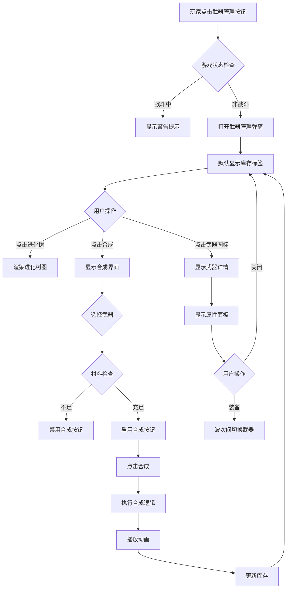

# 武器进化系统需求文档

## 1. 需求类型识别

**需求类型：混合型（功能需求 + UI需求 + 技术优化）**

| 类别 | 占比 | 说明 |
|------|------|------|
| 功能需求 | 60% | 武器合成、进化树、库存管理、武器切换 |
| UI需求 | 30% | 武器管理弹窗、进化树可视化、库存界面 |
| 技术优化 | 10% | 武器持久化、状态管理解耦 |

---

## 2. 用户故事清单（User Stories）

### 2.1 武器获取与收集

**US-WEP-001: 保留武器掉落箱机制**
> **作为** 玩家
> **我想** 继续通过击中掉落箱获得武器
> **以便** 在战斗中即时获取新武器

**验收标准**：
- 现有掉落箱机制保持不变
- 击中掉落箱后武器自动加入永久库存
- 不再有临时武器（duration 机制废除）

---

**US-WEP-002: 永久武器库存**
> **作为** 玩家
> **我想** 收集的武器永久保存在库存中
> **以便** 随时查看和使用已拥有的武器

**验收标准**：
- 获得的武器永久存储（跨波次、跨游戏会话）
- 同一武器可收集多个（用于合成）
- 库存容量无上限

---

### 2.2 武器合成系统

**US-WEP-003: 3合1线性合成**
> **作为** 玩家
> **我想** 用3个相同武器合成为高一级武器
> **以便** 逐步获得更强大的武器

**验收标准**：
- 合成规则：3个相同武器 → 1个高一级武器
- 合成消耗原材料武器（从库存中移除）
- 合成结果立即加入库存
- 材料不足时无法合成（UI灰显）

---

**US-WEP-004: 多起点进化树**
> **作为** 玩家
> **我想** 从步枪/机枪/霰弹枪三条独立路线升级
> **以便** 探索不同的战斗策略

**验收标准**：
- 步枪线：Rifle → Rifle+ → Rifle++ → Super Rifle
- 机枪线：Machinegun → Machinegun+ → Machinegun++ → Super Machinegun
- 霰弹枪线：Shotgun → Shotgun+ → Shotgun++ → Super Shotgun
- 三条路线互不影响
- 每条路线至少4个等级

---

**US-WEP-005: 终极武器融合**
> **作为** 资深玩家
> **我想** 合成三个Super武器获得终极武器
> **以便** 体验游戏巅峰火力

**验收标准**：
- 融合规则：Super Rifle + Super Machinegun + Super Shotgun → Ultimate Laser
- 终极武器属性远超普通武器
- 融合后原材料武器消失
- 终极武器无法再升级

---

### 2.3 武器切换与装备

**US-WEP-006: 波次间武器切换**
> **作为** 玩家
> **我想** 在每波开始前选择要装备的武器
> **以便** 根据战况调整战术

**验收标准**：
- 波次开始前显示武器选择界面
- 可从库存中选择任意已拥有的武器
- 战斗中无法更换武器
- 未选择则使用上一波武器（首波默认Rifle）

---

### 2.4 武器管理界面

**US-WEP-007: 武器库存可视化**
> **作为** 玩家
> **我想** 查看我拥有的所有武器及数量
> **以便** 管理我的武器收藏

**验收标准**：
- 显示所有已拥有武器的图标和数量
- 按武器类型分组显示
- 点击武器查看详细属性
- 实时更新库存数量

---

**US-WEP-008: 进化树可视化**
> **作为** 玩家
> **我想** 看到武器进化的完整路径图
> **以便** 规划合成策略

**验收标准**：
- 树状图显示所有武器及其进化关系
- 已拥有武器高亮显示
- 可合成武器突出提示
- 显示每级武器的基础属性

---

**US-WEP-009: 合成操作区**
> **作为** 玩家
> **我想** 在界面中直接执行合成操作
> **以便** 快速升级武器

**验收标准**：
- 选择武器后显示可合成的下一级
- 显示所需材料和当前拥有数量
- 一键合成按钮
- 合成成功后播放动画和音效

---

### 2.5 游戏平衡

**US-WEP-010: 武器属性平衡**
> **作为** 游戏设计者
> **我想** 确保武器进化不破坏游戏平衡
> **以便** 保持游戏挑战性

**验收标准**：
- 高级武器伤害提升幅度合理（每级+20-30%）
- 终极武器不应一击秒杀所有敌人
- 难度系统同步调整（火力越高怪物越强）
- 保持游戏策略性（不是纯堆火力）

---

## 3. EARS格式系统需求

### 3.1 功能需求（Functional Requirements）

#### FR-WEP-001: 武器库存持久化
**WHEN** 玩家击中武器掉落箱
**THE SYSTEM SHALL** 将武器永久添加到玩家库存中
**AND** 移除临时武器的时效限制

**约束条件**：
- 库存数据使用 localStorage 持久化
- 同一武器可多次收集（数量累加）
- 初始库存包含1个Rifle

---

#### FR-WEP-002: 3合1线性合成规则
**WHEN** 玩家拥有3个或以上相同武器
**THE SYSTEM SHALL** 允许合成为高一级武器
**AND** 消耗3个原武器，增加1个新武器

**约束条件**：
- 合成不可逆（无分解功能）
- 最高级武器（终极武器）无法继续合成
- 合成过程原子化（全部成功或全部失败）

---

#### FR-WEP-003: 多路径进化树
**WHEN** 玩家查看进化树
**THE SYSTEM SHALL** 显示步枪、机枪、霰弹枪三条独立升级路径
**AND** 每条路径包含至少4个等级

**进化路径定义**：
```
Rifle系列：
  Lv1: Rifle (damage: 50, fireRate: 50)
  Lv2: Rifle+ (damage: 65, fireRate: 45)
  Lv3: Rifle++ (damage: 85, fireRate: 40)
  Lv4: Super Rifle (damage: 110, fireRate: 35)

Machinegun系列：
  Lv1: Machinegun (damage: 60, fireRate: 30)
  Lv2: Machinegun+ (damage: 75, fireRate: 25)
  Lv3: Machinegun++ (damage: 95, fireRate: 20)
  Lv4: Super Machinegun (damage: 120, fireRate: 15)

Shotgun系列：
  Lv1: Shotgun (damage: 30, fireRate: 150, bulletCount: 5)
  Lv2: Shotgun+ (damage: 40, fireRate: 130, bulletCount: 5)
  Lv3: Shotgun++ (damage: 55, fireRate: 110, bulletCount: 5)
  Lv4: Super Shotgun (damage: 70, fireRate: 90, bulletCount: 5)
```

---

#### FR-WEP-004: 终极武器融合
**WHEN** 玩家同时拥有 Super Rifle, Super Machinegun, Super Shotgun
**THE SYSTEM SHALL** 允许融合为 Ultimate Laser
**AND** 消耗全部三个Super级武器

**终极武器属性**：
```
Ultimate Laser:
  damage: 150
  fireRate: 10
  bulletCount: 1
  specialEffect: 穿透（子弹击中敌人后继续前进，可连续击中多个敌人）
```

---

#### FR-WEP-005: 波次间武器切换
**WHEN** 新波次开始前
**THE SYSTEM SHALL** 暂停游戏并显示武器选择界面
**AND** 玩家可从库存中选择任意武器装备

**约束条件**：
- 战斗中（waveActive = true）无法切换武器
- 未选择时保持当前装备
- 首次进入游戏默认装备Rifle

---

#### FR-WEP-006: 武器管理弹窗
**WHEN** 玩家点击"武器管理"按钮
**THE SYSTEM SHALL** 打开模态弹窗显示：
- 武器库存列表（所有已拥有武器+数量）
- 武器进化树（树状可视化）
- 合成操作区（选择武器+合成按钮）
- 武器详情面板（属性详情）

**约束条件**：
- 弹窗打开时游戏暂停（战斗外可随时打开）
- 战斗中打开弹窗显示警告提示
- ESC键关闭弹窗

---

### 3.2 非功能需求（Non-Functional Requirements）

#### NFR-WEP-001: 性能要求
**THE SYSTEM SHALL** 在以下性能指标内运行：
- 武器切换响应时间 < 100ms
- 合成动画流畅度 >= 60fps
- 库存加载时间 < 200ms
- 进化树渲染时间 < 300ms

---

#### NFR-WEP-002: 数据持久化
**THE SYSTEM SHALL** 确保数据可靠性：
- localStorage写入失败时显示错误提示
- 支持跨浏览器会话数据恢复
- 提供"重置库存"功能（清除所有数据）

---

#### NFR-WEP-003: UI/UX体验
**THE SYSTEM SHALL** 提供良好的用户体验：
- 赛博朋克风格一致性（霓虹特效、渐变色）
- 所有交互提供视觉反馈（hover、点击、禁用状态）
- 合成成功播放视觉动画和音效
- 移动端响应式设计（可选）

---

#### NFR-WEP-004: 兼容性
**THE SYSTEM SHALL** 兼容以下环境：
- 现代浏览器（Chrome 90+, Firefox 88+, Safari 14+, Edge 90+）
- 不破坏现有游戏逻辑（向后兼容）
- 现有存档可自动迁移（无武器库存的老存档初始化为[Rifle x1]）

---

## 4. Gherkin验收标准

### 场景1：首次收集武器

```gherkin
Feature: 武器收集与库存管理

  Scenario: 玩家首次击中武器掉落箱
    Given 玩家库存为空（仅有初始步枪）
    When 玩家子弹击中一个机枪掉落箱
    Then 系统应将机枪添加到库存
    And 库存中机枪数量应为1
    And 掉落箱应消失
    And 玩家当前装备应切换为机枪
```

---

### 场景2：武器合成成功

```gherkin
Feature: 武器合成系统

  Scenario: 玩家合成高级武器
    Given 玩家库存包含：
      | 武器名称    | 数量 |
      | Rifle      | 5    |
      | Machinegun | 2    |
    When 玩家在合成界面选择"Rifle"
    And 点击"合成"按钮
    Then 系统应消耗3个Rifle
    And 库存中Rifle数量应为2
    And 库存应增加1个Rifle+
    And 播放合成成功动画
```

---

### 场景3：材料不足无法合成

```gherkin
Feature: 武器合成系统

  Scenario: 材料不足时无法合成
    Given 玩家库存包含：
      | 武器名称    | 数量 |
      | Shotgun    | 2    |
    When 玩家在合成界面选择"Shotgun"
    Then 合成按钮应为禁用状态（灰显）
    And 显示提示："需要3个Shotgun才能合成"
```

---

### 场景4：终极武器融合

```gherkin
Feature: 终极武器系统

  Scenario: 融合终极激光炮
    Given 玩家库存包含：
      | 武器名称           | 数量 |
      | Super Rifle       | 1    |
      | Super Machinegun  | 1    |
      | Super Shotgun     | 1    |
    When 玩家在进化树界面点击"Ultimate Laser"节点
    And 确认融合操作
    Then 系统应消耗全部三个Super武器
    And 库存应增加1个Ultimate Laser
    And 播放终极融合动画（特效增强）
```

---

### 场景5：波次间武器切换

```gherkin
Feature: 武器切换系统

  Scenario: 波次开始前更换武器
    Given 当前波次已结束
    And 玩家库存包含：
      | 武器名称    | 数量 |
      | Rifle+     | 1    |
      | Shotgun    | 2    |
    And 玩家当前装备为Rifle+
    When 玩家点击"开始波次"按钮
    Then 系统应暂停游戏
    And 显示武器选择界面
    When 玩家选择Shotgun
    And 点击"确认"按钮
    Then 玩家当前装备应切换为Shotgun
    And 波次应开始
```

---

### 场景6：战斗中无法切换武器

```gherkin
Feature: 武器切换系统

  Scenario: 战斗中尝试打开武器管理
    Given 当前波次正在进行（waveActive = true）
    When 玩家点击"武器管理"按钮
    Then 系统应显示警告提示："战斗中无法更换武器！"
    And 武器管理弹窗应不打开
```

---

### 场景7：进化树可视化

```gherkin
Feature: 武器进化树界面

  Scenario: 查看进化路径并识别可合成武器
    Given 玩家库存包含：
      | 武器名称    | 数量 |
      | Rifle      | 3    |
      | Rifle+     | 1    |
      | Machinegun | 2    |
    When 玩家打开武器管理弹窗
    And 切换到"进化树"标签页
    Then 系统应显示三条完整进化路径
    And Rifle节点应高亮显示（已拥有且可合成）
    And Rifle+节点应高亮显示（已拥有但不可合成）
    And Machinegun节点应显示为灰色（已拥有但数量不足）
    And Rifle++节点应显示为锁定状态（未拥有）
```

---

## 5. 边界场景清单

### 5.1 数据边界

| 场景 | 描述 | 预期行为 |
|------|------|----------|
| 库存为空 | 玩家库存无任何武器（不含初始Rifle） | 自动添加1个Rifle |
| 库存数量爆表 | 某武器数量超过999 | 正常累加，UI显示999+ |
| localStorage满 | 存储空间不足 | 显示错误提示，降级到内存存储 |
| localStorage损坏 | 数据格式异常 | 自动重置库存，提示用户 |

---

### 5.2 操作边界

| 场景 | 描述 | 预期行为 |
|------|------|----------|
| 连续快速点击合成 | 防抖处理 | 合成中禁用按钮，完成后恢复 |
| 同时合成多个武器 | 并发操作 | 串行执行，逐个处理 |
| 切换武器后立即关闭弹窗 | 选择未确认 | 撤销选择，保持原装备 |
| 战斗中库存变化 | 击中掉落箱 | 实时更新库存，但不自动切换装备 |

---

### 5.3 特殊情况

| 场景 | 描述 | 预期行为 |
|------|------|----------|
| 融合终极武器后再次获得Super武器 | 是否允许再次融合 | 允许，可拥有多个Ultimate Laser |
| 装备的武器被合成消耗 | 玩家装备Rifle，合成时消耗掉 | 禁止合成当前装备的武器 |
| 进化树循环依赖 | 数据配置错误 | 启动时校验，发现错误抛出异常 |
| 未知武器类型 | 老存档包含已删除的武器 | 忽略未知武器，记录警告日志 |

---

## 6. UI交互流程

### 6.1 武器管理弹窗结构

```
┌─────────────────────────────────────────────────────┐
│  武器管理                                      [X]   │
├─────────────────────────────────────────────────────┤
│  [库存] [进化树] [合成]                             │
├─────────────────────────────────────────────────────┤
│                                                      │
│  【库存标签页】                                      │
│  ┌──────────┬──────────┬──────────┐                │
│  │  Rifle   │  Rifle+  │  Shotgun │                │
│  │   x5     │   x1     │   x2     │                │
│  └──────────┴──────────┴──────────┘                │
│  ┌──────────┬──────────┐                           │
│  │Machinegun│Ultimate  │                           │
│  │   x0     │Laser x1  │                           │
│  └──────────┴──────────┘                           │
│                                                      │
│  【进化树标签页】                                    │
│        Rifle → Rifle+ → Rifle++ → Super Rifle       │
│          ↘                                  ↘        │
│            \                                  \      │
│  Machinegun → MG+ → MG++ → Super MG → Ultimate Laser│
│            /                          /              │
│          ↗                          ↗                │
│       Shotgun → SG+ → SG++ → Super SG               │
│                                                      │
│  【合成标签页】                                      │
│  选择武器：[Rifle ▼]   拥有：5个                     │
│  合成目标：Rifle+ (需要3个Rifle)                     │
│  [合成] 按钮                                         │
│                                                      │
└─────────────────────────────────────────────────────┘
```

---

### 6.2 交互流程图



---

### 6.3 波次间武器选择流程

```
玩家点击"开始波次"
  ↓
暂停游戏，显示武器选择界面
  ↓
列出库存中所有武器（数量>0）
  ↓
玩家选择武器（可搜索/筛选）
  ↓
点击"确认装备"
  ↓
player.weapon = 选中武器
  ↓
关闭选择界面，开始波次
```

---

## 7. 不确定性与待确认项

### 7.1 设计决策待确认

| 问题 | 选项A | 选项B | 建议 |
|------|-------|-------|------|
| 激光炮去留 | 保留为独立掉落武器（不可合成） | 移除，仅保留可合成武器 | **选项B** - 简化系统 |
| 进化树分支数 | 固定3条路径 | 支持5+条路径（可扩展） | **选项A** - MVP优先 |
| 合成比例 | 固定3:1 | 不同等级不同比例（3:1, 5:1） | **选项A** - 规则统一 |
| 终极武器数量 | 每种最多1个 | 无限制 | **选项B** - 提升可玩性 |
| 武器排序规则 | 按获得时间 | 按等级高低 | **选项B** - 更直观 |

---

### 7.2 技术实现待确认

| 问题 | 影响 | 优先级 |
|------|------|--------|
| 是否支持武器图鉴（已拥有/未拥有全部记录） | 增加UI复杂度 | P2（可选） |
| 是否支持武器皮肤系统 | 需要额外资源管理 | P3（未来） |
| 是否支持成就系统（收集10种武器等） | 增加玩法深度 | P2（可选） |
| 是否支持云端存档同步 | 需要后端服务 | P3（未来） |
| 是否支持好友系统（赠送武器） | 需要社交功能 | P3（未来） |

---

### 7.3 数值平衡待确认

| 问题 | 当前值 | 待验证 |
|------|--------|--------|
| 每级武器伤害提升幅度 | +30% | 是否过强/过弱 |
| 终极武器穿透效果范围 | 无限穿透 | 是否改为最多穿透5个敌人 |
| 合成动画时长 | 1.5秒 | 是否可跳过 |
| 武器掉落箱生成频率 | 与当前一致 | 是否需要降低（因为永久化） |

---

## 8. 术语表（Glossary）

| 术语 | 定义 | 示例 |
|------|------|------|
| 武器库存 (Weapon Inventory) | 玩家永久拥有的所有武器及其数量 | {Rifle: 5, Shotgun: 2} |
| 进化树 (Evolution Tree) | 武器升级路径的树状结构图 | Rifle → Rifle+ → Rifle++ → Super Rifle |
| 合成 (Synthesis) | 用3个相同武器合成为高一级武器的过程 | 3x Rifle → 1x Rifle+ |
| 融合 (Fusion) | 用3个不同Super武器合成终极武器的特殊合成 | Super Rifle + Super MG + Super SG → Ultimate Laser |
| 武器等级 (Weapon Tier) | 武器在进化树中的层级（Lv1-Lv4, Ultimate） | Rifle+为Lv2 |
| 装备武器 (Equipped Weapon) | 玩家当前战斗中使用的武器 | player.weapon.type = 'rifle+' |
| 掉落箱 (Weapon Drop) | 战斗中出现的可拾取武器容器 | WeaponDrop类实例 |
| 波次间 (Between Waves) | 两个波次之间的间隙时间 | waveActive = false |
| 材料 (Material) | 用于合成的原料武器 | 3个Rifle作为材料 |
| 穿透效果 (Penetration) | 终极武器的特殊能力，子弹可击穿多个敌人 | bullet.penetration = true |

---

## 9. 依赖与约束

### 9.1 系统依赖

| 依赖模块 | 依赖内容 | 影响 |
|----------|----------|------|
| CORE | 游戏主循环、状态管理 | 武器切换需暂停游戏循环 |
| PLAYER | 玩家对象、装备武器 | 修改player.weapon结构 |
| COMBAT | 子弹发射、伤害计算 | 新增穿透效果逻辑 |
| UI | 界面渲染、事件监听 | 新增武器管理弹窗组件 |
| DIFFICULTY | 火力等级计算 | 武器等级影响火力倍率 |

---

### 9.2 技术约束

| 约束项 | 内容 | 理由 |
|--------|------|------|
| 存储方式 | 仅使用localStorage | 无后端服务，纯前端实现 |
| 浏览器兼容 | 不支持IE11及以下 | 使用ES6+语法 |
| 数据迁移 | 自动检测老版本存档 | 向后兼容 |
| 性能优化 | 进化树节点<50个 | Canvas渲染限制 |
| UI框架 | 原生JavaScript | 保持技术栈一致 |

---

### 9.3 业务约束

| 约束项 | 内容 | 影响 |
|--------|------|------|
| 合成不可逆 | 无分解/退款功能 | 玩家需谨慎合成 |
| 装备不可合成 | 当前装备的武器禁止合成 | 防止玩家误操作 |
| 波次中不可切换 | 战斗中锁定装备 | 保持游戏平衡 |
| 初始武器固定 | 所有玩家初始为Rifle | 保证公平性 |

---

## 10. 参考游戏机制

### 10.1 Weapon Master（武器合成参考）
- **3合1线性升级**：3个低级 → 1个高级
- **多路径进化**：刀剑/枪械/魔法独立路线
- **终极武器**：顶级武器融合获得神器

**借鉴点**：
- 合成规则简单易懂（固定3:1）
- 进化树可视化清晰
- 终极武器有收集成就感

---

### 10.2 XENOWAR（HTML5架构参考）
- **Canvas 2D渲染**：流畅的战斗画面
- **模块化设计**：独立的武器管理器
- **状态机模式**：游戏状态清晰切换

**借鉴点**：
- 使用独立WeaponManager类
- 状态机管理波次间/战斗中状态
- Canvas绘制优化技巧

---

### 10.3 Count Masters（数字门玩法参考）
- **数字可视化**：直观显示数量
- **即时反馈**：操作立即生效
- **简单策略**：规则简单但有深度

**借鉴点**：
- 武器数量大数字显示
- 合成动画即时反馈
- 策略深度（选择合成时机）

---

## 附录：数据结构设计（草案）

### A.1 武器库存数据结构
```javascript
// localStorage key: 'monsterTide_weaponInventory'
{
  "rifle": 5,
  "rifle+": 1,
  "rifle++": 0,
  "super_rifle": 0,
  "machinegun": 2,
  "machinegun+": 0,
  "machinegun++": 0,
  "super_machinegun": 0,
  "shotgun": 3,
  "shotgun+": 0,
  "shotgun++": 0,
  "super_shotgun": 0,
  "ultimate_laser": 0
}
```

### A.2 武器配置数据
```javascript
const weaponConfig = {
  rifle: {
    id: 'rifle',
    name: '步枪',
    tier: 1,
    damage: 50,
    fireRate: 50,
    bulletCount: 1,
    color: '#ff7948',
    evolutionPath: 'rifle',
    nextTier: 'rifle+'
  },
  'rifle+': {
    id: 'rifle+',
    name: '步枪+',
    tier: 2,
    damage: 65,
    fireRate: 45,
    bulletCount: 1,
    color: '#ff8958',
    evolutionPath: 'rifle',
    nextTier: 'rifle++'
  },
  // ... 其他武器
  ultimate_laser: {
    id: 'ultimate_laser',
    name: '终极激光炮',
    tier: 5,
    damage: 150,
    fireRate: 10,
    bulletCount: 1,
    color: '#00ffff',
    specialEffect: 'penetration',
    evolutionPath: 'ultimate',
    nextTier: null // 最高级
  }
};
```

---

**文档状态**: 草案（Draft）
**下一步**: 提交技术评审 → 更新为 approved 状态
**相关文档**:
- `hhspec/specs/architecture/domain-model.md`
- `hhspec/domains.yml`
