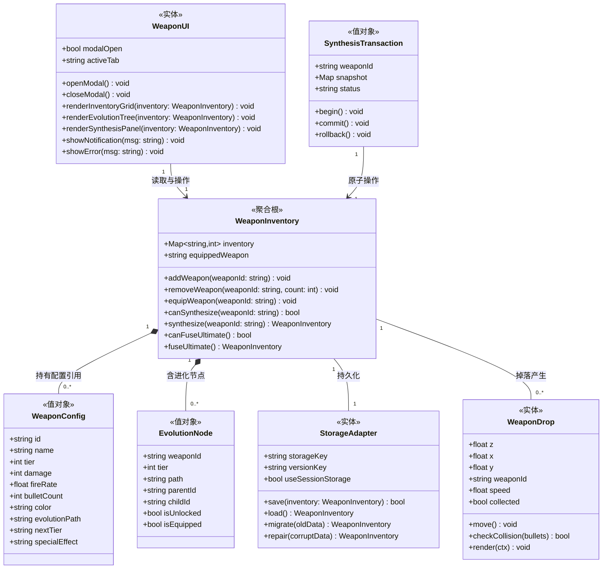

> **逆向生成** — 基于代码分析自动生成，需人工确认和补充。

# 领域模型

## 限界上下文

### 1. 核心游戏系统 (CORE)

**职责**：
- 游戏主循环 (`gameLoop`)
- Canvas 渲染管理
- 全局状态管理 (`game` 对象)
- 波次控制

**核心概念**：
- Game State: gold, lives, wave, score, waveActive
- Canvas Context: 900×700 画布
- 游戏循环：requestAnimationFrame 驱动

---

### 2. 玩家系统 (PLAYER)

**职责**：
- 玩家角色渲染 (`drawPlayer`)
- 玩家状态管理（位置、数量、当前武器）
- 自动射击逻辑 (`autoFire`)

**核心概念**：
- Player: x, y, width, height, count（玩家数量）
- Weapon: type, fireRate, damage, bulletCount

**当前实现**：
- 玩家固定在底部中央
- 自动向前方怪物射击
- 玩家数量影响火力加成

---

### 3. 武器系统 (WEAPON)

**职责**：
- 武器类型定义与进化树配置 (`weaponEvolutionConfig`)
- 武器库存管理 (`WeaponManager`)
- 武器合成与融合逻辑
- 武器掉落生成 (`WeaponDrop` 类)
- localStorage 持久化

**核心概念**：

**武器进化体系**：
- **Evolution Tree**: 树状进化路径，3条独立路径（Rifle/MG/SG）
  - Tier（等级）: 1-5级（Lv1基础武器 → Lv4 Super武器 → Lv5终极武器）
  - Evolution Path: 标识武器所属路径（rifle/machinegun/shotgun/ultimate）
  - Next Tier: 指向下一级武器ID（线性3:1合成）
- **Weapon Config**: 静态配置对象，定义13个武器的属性
  - Base Attributes: damage, fireRate, bulletCount, color
  - Evolution Attributes: tier, evolutionPath, nextTier, id
- **Weapon Inventory**: 永久库存（{weaponId: count}）
  - 存储在 localStorage (`monsterTide_weaponInventory`)
  - 支持同一武器多次收集（数量累加）
  - 初始库存：{rifle: 1}
- **Synthesis Rules**: 3:1线性合成，Super三合一融合
  - 3个同类武器 → 1个高级武器
  - 3个Super武器（不同类）→ 1个Ultimate Laser

**武器进化路径**（13个武器）：
```
Rifle系列（rifle进化路径）:
  Lv1: Rifle → Lv2: Rifle+ → Lv3: Rifle++ → Lv4: Super Rifle

Machinegun系列（machinegun进化路径）:
  Lv1: Machinegun → Lv2: MG+ → Lv3: MG++ → Lv4: Super MG

Shotgun系列（shotgun进化路径）:
  Lv1: Shotgun → Lv2: SG+ → Lv3: SG++ → Lv4: Super SG

终极融合（ultimate进化路径）:
  Super Rifle + Super MG + Super SG → Ultimate Laser (Lv5)
```

**领域实体与值对象**：
- **聚合根**: WeaponInventory（武器库存）
  - 包含：inventory（武器数量映射）、equippedWeapon（当前装备）、maxSlots（最大槽位，可选）
  - 不变量：
    1. 库存数量≥0
    2. 装备武器必须存在于库存中
    3. 初始必有1个Rifle
    4. **装备中的武器不可参与合成**（equippedWeapon 指向的武器在合成时必须先切换，错误码 BIZ-003）
    5. Lv4 Super 武器和 Lv5 Ultimate 武器不可作为合成原料（无 nextTier），错误码 BIZ-004
    6. 终极融合要求 super_rifle、super_machinegun、super_shotgun 各至少1个，错误码 BIZ-005
- **实体**: Weapon（武器）
  - 标识：id（字符串，如'rifle+'）
  - 属性：name, tier, damage, fireRate, bulletCount, color, evolutionPath, nextTier
- **值对象**: WeaponConfig（武器配置）
  - 不可变静态配置，定义武器属性和进化关系
- **事务**: WeaponMergeTransaction（合成事务）
  - 原子化操作：扣减3个原料武器 + 增加1个产物武器
  - 支持回滚（失败时恢复原状态）

**新实现架构**：
```javascript
// 武器配置示例（完整配置见 weaponEvolutionConfig）
weaponConfig = {
  rifle: {
    id: 'rifle',
    name: '步枪',
    tier: 1,
    damage: 50,
    fireRate: 50,
    bulletCount: 1,
    color: '#ff7948',
    evolutionPath: 'rifle',
    nextTier: 'rifle+'
  },
  // ... 其他12个武器配置
  ultimate_laser: {
    id: 'ultimate_laser',
    name: '终极激光炮',
    tier: 5,
    damage: 150,
    fireRate: 10,
    bulletCount: 1,
    color: '#00ffff',
    specialEffect: 'penetration', // 穿透效果
    evolutionPath: 'ultimate',
    nextTier: null // 最高级
  }
}

// 库存数据结构
inventory = {
  "rifle": 5,      // 5个基础步枪
  "rifle+": 1,     // 1个步枪+
  "ultimate_laser": 0
}
```

**扩展方向**：
- ✅ 武器进化系统（本次实现）
- ✅ 武器合成机制（3:1比例）
- ✅ 永久库存系统（localStorage持久化）
- ✅ 进化树可视化（Canvas渲染）

---

## 实体关系图 (Mermaid 类图)



**实体说明**：
- `WeaponInventory`：聚合根，封装库存状态和所有业务规则
- `WeaponConfig`：值对象，武器静态配置（不可变）
- `EvolutionNode`：值对象，进化树节点（含解锁/装备状态）
- `WeaponDrop`：实体，场景中可收集的武器掉落箱
- `StorageAdapter`：实体，封装 localStorage/sessionStorage 操作
- `WeaponUI`：实体，武器管理弹窗 UI（三标签页）
- `SynthesisTransaction`：值对象，合成原子事务（含回滚快照）

---

### 4. 敌人系统 (ENEMY)

**职责**：
- 怪物生成 (`spawnWave`, `continueSpawning`)
- 怪物 AI（向玩家移动）
- 怪物血量与死亡

**核心概念**：
- Enemy: z（深度）, x, y, health, speed, image
- 3D 透视投影：z 值越小越近，渲染时越大

**当前实现**：
- 怪物从远处（z=1500）向玩家冲锋
- 初始血量 15HP
- 速度减半（给玩家反应时间）
- 密集排队（每批 3-5 个）

---

### 5. 战斗系统 (COMBAT)

**职责**：
- 子弹发射 (`Bullet` 类)
- 碰撞检测（子弹 vs 怪物/数字门/武器箱）
- 伤害计算

**核心概念**：
- Bullet: z, x, y, damage, color
- 碰撞检测：3D 距离计算

---

### 6. 数字门系统 (GATE)

**职责**：
- 数字门生成 (`NumberGate` 类)
- 射击增加门上数字
- 碰撞时改变玩家数量

**核心概念**：
- Number Gate: 初始负数（-5, -10）
- 每次被射中 +1
- 到达玩家位置时，`player.count = gate.number`

**策略性**：
- 玩家需要尽可能把负数门打成正数
- 玩家数量越多，火力越强

---

### 7. 难度系统 (DIFFICULTY)

**职责**：
- 火力等级计算 (`getPlayerPowerLevel`)
- 动态调整怪物生成速度 (`adjustDifficulty`)

**核心概念**：
- Power Level = 武器加成 + 玩家数量加成
- 火力越高 → 怪物生成越快

**当前实现**：
```javascript
// 火力等级
powerLevel = weaponMultiplier + playerCount
// 怪物生成间隔
spawnRate = baseSpawnRate / powerLevel
```

---

### 8. 界面系统 (UI)

**职责**：
- HUD 渲染（能量、波次、生命）
- 伤害控制面板
- 赛博朋克风格 UI

**当前实现**：
- HTML 侧边栏（`index.html`）
- Canvas 内游戏画面
- CSS 霓虹特效（`style.css`）

---

## 领域边界

### 依赖关系

```
CORE (游戏循环)
 ├─> PLAYER (玩家渲染与控制)
 │    └─> WEAPON (武器装备)
 ├─> ENEMY (怪物生成与 AI)
 ├─> COMBAT (子弹与碰撞)
 │    ├─> WEAPON (伤害计算)
 │    ├─> ENEMY (碰撞检测)
 │    └─> GATE (射击门)
 ├─> GATE (数字门逻辑)
 │    └─> PLAYER (改变玩家数量)
 ├─> DIFFICULTY (动态难度)
 │    ├─> PLAYER (火力等级)
 │    └─> ENEMY (生成速率)
 └─> UI (界面更新)
```

### 跨界交互

| 交互 | 说明 |
|------|------|
| PLAYER → WEAPON | 玩家切换武器、武器影响射击 |
| COMBAT → ENEMY | 子弹击中怪物，扣血 |
| COMBAT → GATE | 子弹击中门，数字 +1 |
| GATE → PLAYER | 门碰到玩家，改变 player.count |
| WEAPON → DIFFICULTY | 武器类型影响火力等级 |
| PLAYER → DIFFICULTY | 玩家数量影响火力等级 |
| DIFFICULTY → ENEMY | 火力等级影响怪物生成速度 |
| UI → WEAPON | 武器管理弹窗调用库存数据、合成操作 |

---

## 依赖矩阵

|           | CORE | PLAYER | WEAPON | ENEMY | COMBAT | GATE | DIFF | UI |
|-----------|------|--------|--------|-------|--------|------|------|----|
| CORE      | -    | ✓      | ✓      | ✓     | ✓      | ✓    | ✓    | ✓  |
| PLAYER    |      | -      | ✓      |       |        |      |      |    |
| WEAPON    |      |        | -      |       |        |      |      |    |
| ENEMY     |      |        |        | -     |        |      |      |    |
| COMBAT    |      | ✓      | ✓      | ✓     | -      | ✓    |      |    |
| GATE      |      | ✓      |        |       |        | -    |      |    |
| DIFF      |      | ✓      | ✓      | ✓     |        |      | -    |    |
| UI        | ✓    | ✓      | ✓      | ✓     |        |      | ✓    | -  |

**说明**：✓ 表示行依赖列（例如 CORE 依赖 PLAYER，PLAYER 依赖 WEAPON，UI 依赖 WEAPON）

---

## 领域职责划分

### CORE领域职责
**对外接口**:
- `gameLoop()` - 主循环入口
- `pauseGame()` / `resumeGame()` - 游戏暂停/恢复
- `game` 对象 - 全局状态访问

**职责范围**:
- 游戏主循环与渲染调度（requestAnimationFrame）
- Canvas 2D 上下文管理（900×700画布）
- 全局状态管理（gold, lives, wave, score, waveActive）
- 波次控制（spawnWave, 波次结束检测）

**依赖边界**: 依赖 PLAYER、WEAPON、ENEMY、COMBAT、GATE、DIFFICULTY、UI（协调各领域）

**不负责**: 具体领域逻辑（玩家移动、武器合成、怪物AI等由各领域独立处理）

---

### PLAYER领域职责
**对外接口**:
- `player` 对象 - 玩家状态（x, y, count, weapon）
- `drawPlayer()` - 玩家渲染
- `autoFire()` - 自动射击
- `equipWeapon(weaponId)` - 装备武器

**职责范围**:
- 玩家角色渲染（底部中央固定位置）
- 玩家状态管理（位置、数量、当前装备武器）
- 自动射击逻辑（面向最近怪物）
- 武器装备切换（调用 WEAPON 领域）

**依赖边界**: 依赖 WEAPON（获取武器属性）

**不负责**: 武器库存管理（由 WEAPON 领域负责）、伤害计算（由 COMBAT 领域负责）

---

### WEAPON领域职责
**对外接口**:
- `getInventory()` - 获取武器库存
- `addToInventory(weaponId)` - 添加武器到库存
- `synthesizeWeapon(weaponId)` - 合成武器（3:1）
- `fuseUltimateWeapon()` - 融合终极武器
- `saveInventory()` / `loadInventory()` - 持久化操作
- `weaponConfig` - 武器配置静态数据

**职责范围**:
- 武器类型定义与进化树配置（13个武器，3条进化路径 + 终极武器）
- 武器库存管理（localStorage 持久化）
- 武器合成与融合逻辑（3:1线性合成、Super三合一融合）
- 武器掉落箱生成与碰撞检测（WeaponDrop类）
- 数据迁移（老存档兼容）

**依赖边界**: 无依赖（独立领域），被 PLAYER、UI、DIFFICULTY 依赖

**不负责**: 武器伤害计算（由 COMBAT 领域负责）、武器UI渲染（由 UI 领域负责）

---

### ENEMY领域职责
**对外接口**:
- `enemies` 数组 - 当前存活怪物列表
- `spawnWave()` - 生成新波次
- `continueSpawning()` - 持续生成怪物

**职责范围**:
- 怪物生成（从 z=1500 远处生成）
- 怪物AI（向玩家冲锋）
- 怪物血量与死亡处理
- 3D 透视投影（z 值深度转换）

**依赖边界**: 无依赖（独立领域），被 CORE、COMBAT、DIFFICULTY 依赖

**不负责**: 怪物伤害计算（由 COMBAT 领域负责）、难度调整（由 DIFFICULTY 领域负责）

---

### COMBAT领域职责
**对外接口**:
- `bullets` 数组 - 当前飞行子弹列表
- `Bullet` 类 - 子弹实体

**职责范围**:
- 子弹发射（基于武器属性）
- 碰撞检测（子弹 vs 怪物/数字门/武器箱）
- 伤害计算（基于武器damage属性）
- 3D 距离计算（子弹与目标的空间距离）

**依赖边界**: 依赖 PLAYER（获取武器属性）、WEAPON（伤害数据）、ENEMY（碰撞检测）、GATE（射击门逻辑）

**不负责**: 武器属性定义（由 WEAPON 领域负责）、怪物生成（由 ENEMY 领域负责）

---

### GATE领域职责
**对外接口**:
- `gates` 数组 - 当前数字门列表
- `NumberGate` 类 - 数字门实体

**职责范围**:
- 数字门生成（初始负数，-5到-10）
- 射击增加门上数字（每次被击中+1）
- 碰撞时改变玩家数量（player.count = gate.number）

**依赖边界**: 依赖 PLAYER（修改玩家数量）

**不负责**: 玩家数量影响火力（由 DIFFICULTY 领域负责）

---

### DIFFICULTY领域职责
**对外接口**:
- `getPlayerPowerLevel()` - 计算火力等级
- `adjustDifficulty()` - 动态调整难度

**职责范围**:
- 火力等级计算（武器加成 + 玩家数量加成）
- 动态调整怪物生成速度（火力越高，怪物生成越快）
- 难度平衡（保持游戏挑战性）

**依赖边界**: 依赖 PLAYER（玩家数量）、WEAPON（武器等级）、ENEMY（调整生成速率）

**不负责**: 具体生成逻辑（由 ENEMY 领域负责）

---

### UI领域职责
**对外接口**:
- `openWeaponModal()` - 打开武器管理弹窗
- `renderEvolutionTree()` - 渲染进化树
- `renderInventoryGrid()` - 渲染库存界面
- `showWeaponSelectModal(callback)` - 波次间武器选择

**职责范围**:
- HUD 渲染（能量、波次、生命、金币）
- 武器管理弹窗（库存、进化树、合成界面三标签页）
- 进化树可视化（Canvas树状图，高亮已拥有武器）
- 合成界面（材料检查、合成按钮、动画）
- 波次间武器选择界面
- 赛博朋克风格 UI（霓虹特效、渐变色）

**依赖边界**: 依赖 CORE（暂停游戏）、PLAYER（玩家状态）、WEAPON（库存数据、合成操作）、ENEMY（怪物数量显示）、DIFFICULTY（火力等级显示）

**不负责**: 业务逻辑（武器合成逻辑由 WEAPON 领域负责，UI 仅调用接口）

---

## 架构特点

### 优势
- 单文件 game.js，代码集中易维护
- 无服务器依赖，纯前端运行
- Canvas 2D + 伪 3D 透视，性能好

### 局限
- 代码耦合度高（单文件 800+ 行）
- 武器系统功能单一（临时掉落，无进化）
- 无模块化，难以扩展新系统

---

## 扩展方向

### 武器进化系统（本次需求）
- 解耦武器逻辑，独立 WeaponManager
- 引入武器等级、合成树
- 持久化武器库存
